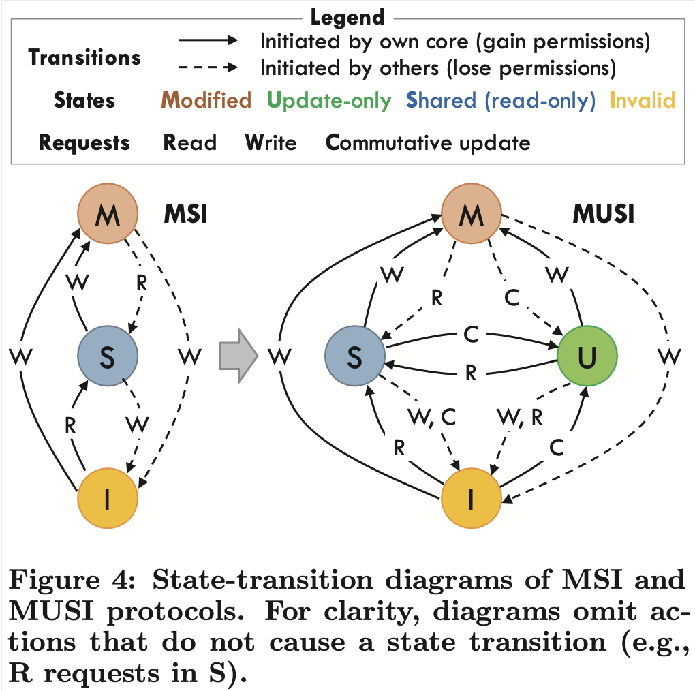
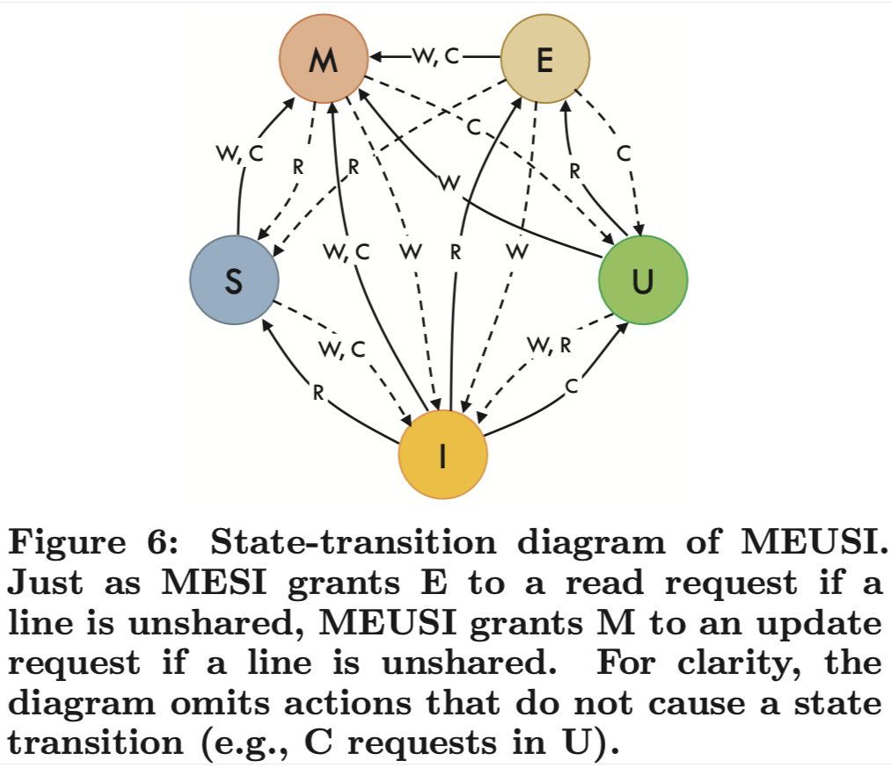
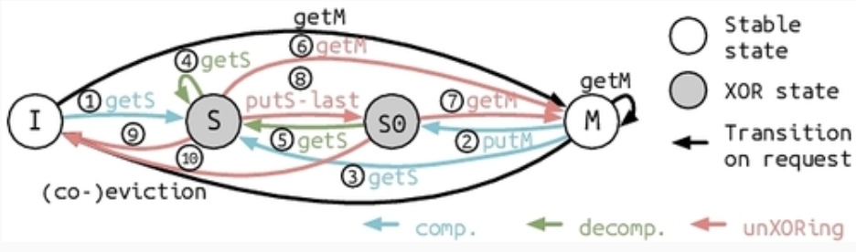
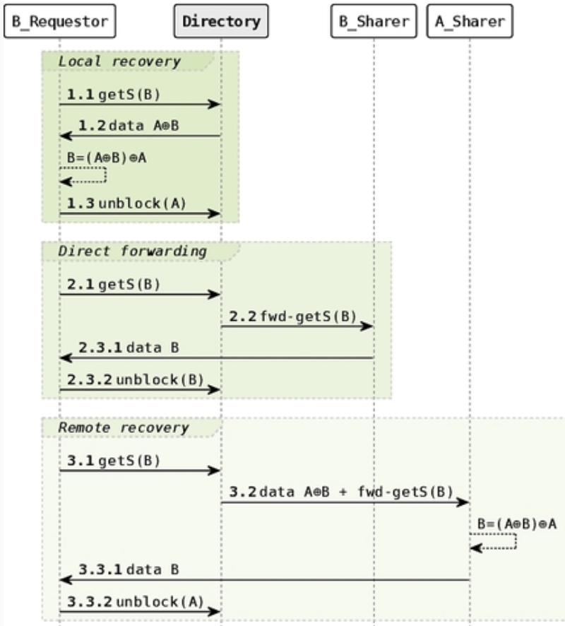

# [wiscECE757[12]] Exploiting Commutativity to Reduce the Cost of Updates to Shared Data in Cache-Coherent Systems
利用交换律降低缓存一致性系统中共享数据更新的成本

个人总结：
类比：收集部分更新 等一起更新

## Abstract
基于: Many update operations (e.g. additions and bitwise logical operations) are commutative具有交换律: they produce the same final result regardless of the order they are performed in.
提出: Coup 允许多个private cache同时拥有对同一cache line的update-only权限。具有update-only权限的缓存可以locally buffer and coalesce合并对该缓存行的更新，但不能满足read request。当收到read request时，Coup 会将partial updates buffered in the private cache合并为最终值。
集成：可以seamlessly集成到现有的coherence protocols
成果：将 Coup 应用于加速共享数据的单字更新。在一个模拟的 128-core 8-socket系统中，Coup 将update-heavy算法的现有state-of-the-art实现速度提升了高达 2.4 倍。

## INTRODUCTION
**当前**的缓存一致性协议会造成远超所需的流量traffic和串行化serialization，尤其是在frequent updates to shared data的情况下。
E.g. 考虑一个由多个cores更新的shared counter。每次更新时，更新核心首先会将an exclusive copy of the counter’s cache line
提取到其私有缓存中，invalidating所有其他副本，然后使用原子操作（例如取加操作）在本地对其进行修改。每次更新都会产生大量的流量和串行化：
- 需要流量来提取缓存行并使其他副本失效，导致缓存行在更新核心之间来回传递ping-pong；
- 由于一次只能有一个核心执行更新操作，因此也会产生串行化serilization。

**当前有的改进-硬件**
mainly focused on remote memory operations/RMOs: 将更新发送到a single memory controller或shared cache bank，
* (+) 不需要反复抢独占权限/不需要 cache line ping-pong
* (-) 每次 add 仍然发送一条远程请求+做一次单独更新, 显著的全局流量和串行化

**当前有的改进的欠缺**
* 传统的缓存一致性协议仅支持两种基本操作：read和write，因此commutative updates 必须被表示为a read- modify-write sequence.
    * 单字更新操作需要使用开销较大的原子读-修改-写指令才能完成。
* 传统协议没有 解耦decouple 读取和写入权限, enforce the single-writer-multiple reader invariant不变式: at any given time, a cache line 最多只能有一个具有读写权限的共享者or有多个具有只读权限的共享者

**COUP**基于
* 许多更新操作无需读取被更新的数据。
* 更新操作通常满足交换律，可以在读取数据之前以任意顺序执行
E.g. a shared counter: 来自不同核心的多个加法运算可以进行缓冲、合并，并延迟到下次读取计数器行时执行。
**改进欠缺**：
* decouples read and write permissions， 在读写操作的基础上引入了 可交换更新原语/commutative-update primitive operation
得到：……(COUP原理再讲一遍)
优势: ……

## BACKGROUND
(降低共享数据更新成本的先前的硬件技术和软件技术)

**硬件技术**：(联系最紧密的)远程内存操作RMO 已有的改进：
* implementing atomic fetch-and-add using adders in network switches, which could coalesce合并 multiple requests on their way to memory.
* implemented RMOs at the memory controllers
* implement RMOs in shared caches.
* adding caches to memory controllers to accelerate RMOs and data-parallel RMOs

C**OUP较RMO的优势**:
* RMO虽然不需要ping-ponging cache lines，但是仍需要send every update to a shared, fixed location => global traffic
    * RMOs are also limited by the throughput of the single updater. e.g. 频繁的远程添加请求会导致共享缓存的 ALU 接近饱和。
        * COUP 将更新缓冲并合并到本地缓存中, 等收到read request的时候，shared cache再收每个本地cache updater的数值
* RMO 要实现强一致性模型很难，因为难以约束内存操作顺序。具体解释：	在传统 cache-coherent 多核里，一个核发出的 store 通常先进入本地 store buffer，再以一定规则进入 cache/互连，最后对别的核“可见”。一致性模型本质上就是要保证“哪些操作先对外可见、哪些后可见”。而 RMO 的特点是：更新不是在本地 cache 里完成，而是被发到一个固定的远端位置（内存控制器/共享 cache/网络设备）去执行。这就把“谁先可见”变得更难管，因为可见性不再由本核这条 pipeline 直接决定，而是被网络排队、远端处理队列、合并等因素搅乱。
    * Coup 的关键点是：仍然让updates在local cache 层面发生，只是让多个核在 update-only 模式下各自缓存“部分更新”，最后 reduction。所以对一致性模型来说，不必处理“远端执行导致的可见性乱序难题”，维护一致性更容易

**COUP的代价**: 
* 操作集仅限于可交换更新，而 RMO 支持非可交换操作
> Coup 只对这类操作有效：
> x += 1
> x |= mask
> x = max(x, v)（某些场景）
> ...
* 只有当数据被重用时（updated or read multiple times before switching between read- and update-only modes），COUP 的性能才会显著优于 RMO。

**软件技术：两种通用技术**：委托delegation 和 私有化privatization
委托delegation机制 将共享数据分配给各个线程，并使用 共享内存队列/活动消息 将更新发送给相应的线程。
- 是RMO的软件对应机制：减少了数据移动和同步，但会增加全局流量和序列化。

（见下MOTIVATING APPLICATIONS）私有化privatization方案 将可交换更新缓存在线程私有存储中，并通过读取操作来归约这些线程私有更新，从而得到正确的值。通常用于更新频繁而读取较少的情况。
- 是 COUP 的软件对应物：仅限于可交换更新，并且在data goes through long update-only phases without intervening reads 时效果最佳。
- 与COUP的不同：privatization有两个主要的overhead，导致Coup is about as fast as a conventional protocol if a line is updated only once before being read, 但 software reductions 慢很多，导致finely-interleaved reads and updates inefficient/频繁 reduction 会炸
    * Privatization 的 reduction 是软件层的全局归并：(1) 需要同步(确保其它线程不再更新了)、合并N 份线程的完整副本; 
        * (2) With N threads, privatized variables increase 内存占用/memory footprint by a factor of N. 
    * Coup 的 reduction 是硬件层的按需增量归并：(1) 合并被读到的那些 cache line 的增量
        * (2) 没有把每个线程/每个核的私有副本放到内存里, 而是让多个核在自己的缓存里临时保存 对同一份共享数据的partial updates，而共享数据的基值base copy始终只有一份，放在内存/共享缓存层级中。

## ERENCE TO SUPPORT COMMUTATIVE UPDATES
**e.g. 传统 MSI 扩展=> MUSI （做单字加法）**

**硬件结构变化**：
* 新指令commutative-update instructions: 在大多数指令集架构 ISA中，Coup 需要额外的指令来允许程序传递可交换更新，因为传统的原子指令（例如取指加法）会返回它们更新的数据的最新值。
    * 某些ISA可能不需要额外的指令。例如，最新的异构系统架构HSA 包含不返回更新值的atomic-no-return指令。虽然这些指令的引入可能是为了降低 RMO 的成本，但 COUP 可以直接使用它们
* 新FSM: update-only state; (a third type of request) C/commutative update 和传统的 R、W 并列; 
    * 允许多个private cache同时持有对同一行 line 的read-only权限，在本地满足read request （S）
    * 允许多个 private cache 同时持有同一条 line 的 update-only 权限，于是多个核可以在本地“攒更新”/在本地满足commutative-update requests （U）
    * 至多1个private cache 对一行有exclusive permission, 在本地满足所有类型的请求(M）
* Directory state: In Coup, the directory must track whether sharers have exclusive, read-only, or update-only permission.  \共享者位向量可用于跟踪多个读取者或多个更新者，因此 MUSI 只需要每个目录标签额外添加一个位。
    * 传统目录必须跟踪每一行的共享者， 并且如果只有一个共享者，则需要跟踪其权限是独占/只读。
* 新硬件点：reduction unit/归约单元: 当有人要读时，系统需要把 partial updates 聚起来做归约，所以在共享 cache 侧加一个 reduction unit 

**协议操作**：
- 如何执行“可交换更新”: private cache 只要处于 M（独占可读写） 或 U（update-only），就能在本地直接做 commutative update（比如 add / or）。在 M 状态下，存储的是实际数据值；在 U 状态下，存储的是部分更新值。
    - 无论哪种情况，核心都可以通过原子地从缓存中读取数据、修改数据（通过加上可交换加法指令指定的值）并将结果存储回缓存来执行更新。=> 可以复用已有 atomic 硬件路径。
- 怎么进入 U 状态：当P1要做可交换更新/发出C-request，P1处于 I / S, 自己这边权限不够，向目录请求“update-only 权限”，目录会:
    - 把其他处于 S 的副本 invalid 掉, P1转到U
    - 把这个某个处于 M 的单一拥有者P0降级成 U，发给P1, P1转到U
        - P0看到别人的GETU, 被目录降级，把自己此时的真实数据传给 shared cache
	关键点：一旦进入 U，line 的内容会被初始化成 identity element（比如加法的 0），即使它原来有真实数据。这样做是为了避免“到底谁手里保留着原值”这种跟踪复杂度；真实原值仍在 shared cache 里，之后 reduction 时会用到。
- 怎么离开 U
    - private cache eviction ⇒ partial reduction：某核把 U 状态 line 挤出私有 cache 时，会把自己攒的partial update 发回 shared cache，由 shared cache 的 reduction unit 把它合并进共享端的累计值。
    - shared cache eviction ⇒ full reduction： 
        - 如果有核发起读（需要拿到真实值），目录会触发 full reduction，让所有持有 U 的 cache 交回各自的 partial update，然后 reduction unit 把“shared cache 里的原值 + 全部 partial update”聚合成最终值，再把 line 以可读方式提供出去。
        - 如果 shared cache 自己要 eviction 一个仍被多个 U 持有的 line，也会触发 full reduction（同样要收集全部 partial update）。
		论文也承认：full reduction 的读延迟可能比传统协议更高，但它强调两点：可以用层次化 reduction 降关键路径，而且通常 reduction 的开销相对通信延迟不算大。

**把 Coup 推广到更真实的系统**
- 支持多种可交换操作：形式上，Coup 可以用于任何 可交换半群commutative semigroup 里的操作，比如 add、and、or、xor、min、max 等。
    - 要支持多操作，需要：
        - ISA 提供不同 update 指令；
        - reduction unit 支持这些操作；
        - directory 和 cache 在 U 状态要记录“当前这条 line 的操作类型”；
        - 必须序列化不同类型的更新（一般不彼此可交换, e.g. + 和 * 混在一起顺序会影响结果）。所以当遇到“不同类型更新”时，就先做一次 full reduction，把旧类型的 partial updates 全部收敛掉，再切换类型。
- 支持更大的 cache block（多 word）：论文假设数据对齐，不对齐的更新就退回普通 read-modify-write。
    - 如果操作有 identity element（即构成 commutative monoid），那就简单：进入 U 时把整条 cache line 的每个 word 初始化为 identity（加法全置 0、乘法置 1、AND 置全 1 等），reduction 时对每个 word 做 element-wise 操作即可。
    - 如果没有 identity element，就得每个 word 多加 bit 标记“是否初始化”。
- 扩展到其他协议MEUSI：类似 MESI 在“无人共享时”给读者 E，MEUSI 在“无人共享时”也可以把 update 请求直接给到 M（因为独占时更新 等价 写）。
  
- 多级 cache/目录: COUP要求层次化 reduction：任何一个拥有多个子节点、且子节点可能发 update 的层级，都要有 reduction unit。
  > e.g. 128 核 with a fully-shared L4 and 8 L3 shared caches (each shared by 16 cores)，关键路径操作数从“平面 128 次”变成 “8 + 16 = 24 次”。

**Coup 为什么不破坏“缓存一致性/内存一致性”？**（作为作者必须交代的“安全性”）
- 一致性coherence：Coup 在 update-only 模式下虽然允许多个核并发更新，但因为这些更新可交换，你怎么给它们排串行顺序都得到同一个结果；且从 U 切回可读/独占模式时会把 partial updates 都传播出去，保证下一个读者看到“最新归约值” 
    - 标准定义：A memory system is coherent if, for each memory location, it is possible to construct a hypothetical serial order of all operations to the location that is consistent with the results of the execution and that obeys two invariants: （1） 每核发出的顺序不被打乱Operations issued by each core occur in the order in which they were issued to the memory system by that core. （2） 每次读到的值等于那个串行顺序里最近一次写的值The value returned by each read operation is the value written to that location in the serial order.
- 内存一致性模型consistency：只要系统对 commutative update 的顺序约束“像对 store 一样严格”，Coup 不改变一致性模型。工程上等价做法是：让各种 fence 对 commutative update 也生效, 不需要额外新 fence指令。

**Implementation and Verification Costs**：用“泛化的 N 状态”把复杂度压下去
现实协议有 transient states、乱序消息、竞态，验证很痛。
* 引入Generalized non-exclusive state: S（只读共享）和 U（只更新共享）高度对称，于是把 S 和 U 合并成一个更通用的 N（non-exclusive）状态, 省“状态机复杂度”：
    * 多个 cache 可以同时持有 N，但必须“操作类型一致”（要么都是 read-only，要么都是同一种 commutative update）=> 每条处于 N 的 line 额外带一个字段记录当前操作类型；
    * E 和 M：因为是独占，能满足任何 type 的请求；如果是 commutative update，E 需要先转 M（E→M）。
    * N：如果新请求的 type 和当前 N 的 type 一样 → 直接满足（无需大动作）；如果新请求的 type 不一样 → 就要做 type switch：
        * 从 read-only 切到别的 type：触发 invalidation（把旧的只读共享者清掉）
        * 从 commutative-update type 切到别的 type：触发 reduction（先把 partial updates 合并回 base）
	结果是实现状态数几乎不涨（+）：两级 MEUSI 用这种方式，只比 MESI 的 L1 多一个 transient state（NN，用于操作类型切换）。避免了因为引入 U 而让状态机膨胀成一个很难实现/很难验证的怪物
* Verification cost：用 Murphi (局限性：只能验证最多 4-8 个核心的系统) 做穷举验证时，成本time主要随“核数和层级”涨，比“支持多少种 commutative ops”更敏感，说明扩展多种操作类型不会把验证炸得太离谱。

### Motivating Applications
（Coup 到底在什么类型的并行程序里“真有用”，而不是只是把原子操作换个名字？）
COUP 是”私有化”的硬件对应物. 当满足下面任一条件时，Coup 相比软件技术更优：
1. 读和更新细粒度交错：软件私有化需要软件 全局reduction（同步 + 归约代码路径），这套合并逻辑通常不在缓存协议的快路径上，而是函数调用/循环/屏障/并行归约树等
    1. 只要每个 update-only epoch 里每核有很少更新（作者说甚至“两次更新”级别），也能赚到。
2. 被更新的共享数据量很大：软件私有化会把数据复制成每线程一份，导致 footprint 乘以线程数，挤爆 cache

（几种具有这些特性的并行模式和应用：）
分离的 Update-only / Read-only 阶段
- Reduction variables/规约变量：在循环多次迭代中使用a binary, commutative operator（a 归约运算符）进行更新的对象，其中间状态不会被读取。
    - 多种并行编程语言和库原生支持归约变量。并行编译器领域的研究已经开发出多种技术来检测和利用归约变量。
    * 小标量规约（比如求最大值/均值）reduce 很快，Coup 帮助不大。
    * 但大结构规约（比如直方图数组、矩阵/向量等）reduce 可能成为瓶颈：软件私有化要么复制大数组、要么用哈希表等技巧减少复制，但都会带来额外时间开销与复杂性；Coup 的卖点是内存里始终只有一份结构，多个核只在自己的 cache 里累积“局部增量”，读时再合并，因此可以重叠更新阶段与合并阶段，避免软件 reduce 集中爆炸。
    * 归约变量和其他仅更新操作通常使用浮点数据，虽然浮点严格来说不满足结合/交换律，但现实并行规约本来就常常非确定；因此他们选择支持浮点加法，追求性能；若要可复现，可用软件确定性规约。
- Ghost cells/幽灵单元: 规则网格的迭代算法中，线程通常处理不相交的数据块，并且只需要将更新信息传递给处理相邻数据块的线程。常用 ghost cells：边界单元的私有副本，每个线程在迭代期间更新这些副本，并在下一次迭代中被相邻线程读取。
    - 这本质也是一种私有化，但有额外维护/复制开销；Coup 允许多个线程直接更新边界单元来避免幽灵单元的开销2
* 对不规则数据（比如 PageRank）做这种划分更难，Coup 通过降低共享更新代价，对这类也更友好。

Interleaved Updates and Reads
这一类是软件私有化很难用的：因为你不能每次读之前都停下来做全局 reduce；而 Coup 的协议能按访问行为在 U（update-only）与 S（read-only）之间“透明切换”。
- Graph traversals / BFS 的 visited bitmap：高性能 BFS 常用 bitmap 记录 visited：写方做 OR/set bit，读方查 bit。
    * 传统做法要么用 atomic-or（更新被序列化），要么用非原子 load-or-store（会漏更新，导致重复访问）。两种情况都让来自多个线程的更新被串行化
    * Coup 的优势：允许多个核同时对同一 cache line 的不同 bit 做并发 OR 更新。
- Reference counting/引用计数：每个object都有一个计数器来跟踪active reference的数量。线程在创建新引用时会加一，在destroy引用时会减一并读取计数器。When the reference count reaches zero, the object is garbage-collected.
    * 软件上有很多复杂技巧：SNZI（树形计数）让“非零判断”更快(只需检查根节点即可确定计数是否为零)但空间/调参成本高；Refcache: 线程维护a software cache，用于存储引用计数增量delta，并定期将其刷新到全局计数器。减少开销但会delayed 释放 hurts memory footprint and locality
    * Coup 的位置：既能做共享引用计数且无空间复制开销，又能减少一致性流量；还可以把“延迟引用计数”的思想搬到硬件侧，不需要软件 delta-cache。

### Evaluation 
Coup 在真实（模拟）多核/多 socket 系统里，到底能快多少？为什么快？硬件代价如何？对不同场景（私有化/引用计数）是否真能胜？

模拟平台与系统结构: 用 zsim 做执行驱动微结构模拟，评估 1–128 核、四级 cache 层次（含多 socket + “dancehall”到 L4/目录芯片），组织类似 IBM z13。
* 对比 MESI vs MEUSI: 在 MEUSI 下，每个 L3/L4 bank 都有 reduction unit，并做层次化 reduction（先在 L3 聚合子节点，再回 L4）。
* Coup operations and data types
    * 新增 8 种eight commutative-update types：16/32/64 位整数加法；32/64 位浮点加法; 64 位 AND/OR/XOR 位运算
    * COUP 对标量归约带来的好处微乎其微。因此，我们不支持min或max
* (8条) Commutative-update instructions: 为每个支持的操作和数据类型添加一条指令。每条指令接受两个寄存器输入，分别是要更新的地址和要应用的值，并且不产生任何寄存器输出。
* reduction unit : 假设一个 2-stage pipeline 的 256-bit ALU（4×64-bit lane），吞吐：每 2 cycles 处理一条 64B cache line，延迟 3 cycles；并在后面做reduction unit的吞吐敏感性分析。

工作负载（5 个基准）：hist（OpenCV/TBB 直方图）、spmv（CSC 稀疏矩阵向量乘）、fluidanimate（PARSEC，作者把原锁更新改成原子更新对比）、pgrank（PageRank）、bfs（PBFS 改造 + visited bitvector）。

Comparison Against Atomic Operations（Coup vs 传统 MESI + 原子 R-M-W)
- 在 128 核时，Coup 对 MESI 的加速分别为：hist：2.4×; spmv：+34%; pgrank：2.4×; bfs：+20%; fluidanimate：+4%。并解释为什么不同应用收益差这么大：
    * hist / spmv / pgrank：共享数据经历较长 update-only 阶段 → Coup 最吃香。
    * bfs：visited 位图导致 cache line 在 U/S 间频繁切换 → 优势仍有但较小。
    * fluidanimate：共享单元只占一部分、且每轮邻居写入次数少 → 所以提升很小。
- 平均内存访问延迟/AMAT 分解：按 L2/L3/片外网络/L4/一致性失效/主存拆开，强调 Coup 的主要贡献是减少 invalidations 和序列化。在 128 核时，Coup 相对 MESI 的 AMAT 改善幅度：hist：AMAT 低 12.6×；spmv：低 10%；pgrank：低 3.0×；bfs：低 24%；fluidanimate：低 12%。
    - spmv 虽然也几乎消掉 invalidation，但它的 AMAT 主要被 L4/主存访问主导，所以总体改善不如 hist/pgrank 那么夸张。
- 流量traffic也显著下降：在 128 核时，Coup 的 off-chip 流量相比 MESI：hist：低 20.2×；spmv：低 18%；pgrank：低 4.9×；bfs：低 20%；fluidanimate：低 18%
一个很有意思的观察：这些基准里 commutative-update 指令占比其实不高（比如 hist 只有约 1%），但在大核数下，一次 contended 原子 RMW 可能要几百 cycle，所以收益依然巨大。

Case Study: Reduction Variables/规约变量 vs软件私有化
作者说明：基准默认都用原子操作而不是私有化，然后专门在 hist 上做“软件私有化 vs Coup”的对比。
这里他们比较两种软件私有化粒度：
* core-level privatization（每核一份直方图）
* socket-level privatization（每 socket 一份直方图）
核心结论（作者用“少 bin”和“多 bin”两种情况说明 trade-off）：
* 当 bin 少时，每线程对每个 bin 的更新很多，reduce 成本能被高度摊薄，所以软件私有化表现也不错。
* 当 bin 多时，每线程对每个 bin 的更新很少，reduce 成本反而主导：此时 Coup 比 core-level 私有化快 2.5×，比 socket-level 私有化快 51%。
* 私有化还会增加 footprint、给共享 cache 压力：作者把 bin 数和图像一起放大（保持“每 bin 更新次数”不变）后，看到 core-level 私有化在总私有化直方图溢出 L3 时额外掉 9%，而 Coup 没这个问题。
这部分本质上是在呼应第 4 节的动机：Coup 想要在“私有化很尴尬”的区域胜出, 读写交错更细、或者数据结构大到不适合复制。

Case Study: Reference Counting/引用计数
作者用两个 microbenchmark 对比 Coup 与经典软件方案：
* “立即回收”类：对比 atomic fetch-and-add（文中用 XADD）与 SNZI。设定：1–128 线程、每线程 100 万次更新、1024 个共享 counter，随机选 counter 做 inc 或 dec+read。
    * 作者强调 SNZI 的效果取决于“对象引用数”。引用越多，树节点 surplus 越高，更新冲突越低。于是他们做了：
        * low-count：每线程对每对象只保持 0 或 1 个引用（更容易降到 0）
            * SNZI 在计数掉到 0 时开销高，所以 Coup 和 XADD 都超过 SNZI；128 核时 Coup 比 SNZI 快 50%，XADD 快 17%。
        * high-count：每线程最多 5 个引用，用不同概率决定是否继续 inc，模拟“引用常年不为 0”的对象结果：
            * SNZI 因为冲突更低反而胜出，128 核时 SNZI 比 Coup 快 35%。
	作者并没有宣称 Coup “统治一切”，而是明确给出边界——当软件用更强结构（树化分散更新）能显著降低冲突时，Coup 可能不是最优。
* “延迟回收”类：对比 Refcache 通过软件缓存 delta 并周期 flush，代价是延迟回收影响 footprint/locality，而 Coup 可以在不需要软件 delta-cache 的情况下支持类似思路。

Sensitivity to Reduction Unit Throughput（reduction unit 会不会成为硬件瓶颈？）
几乎不敏感。他们把默认的 256-bit pipeline ALU（每 2 cycles 一条线）换成更慢的、非流水的 64-bit ALU（每 16 cycles 一条线），在最坏情况下（128 核 bfs）性能下降也只有 0.88%。
含义：在他们的系统假设里，读触发 reduction 的开销主要还是通信/一致性往返，而不是 ALU 算不过来。

## Additional Related Work
这一节作者把 Coup 放进更大的研究谱系里，并强调“我和你们不一样在哪”。
* LCM/Loosely Consistent Memory：允许多个 cache 持有可写副本，但会变得“不一致”，需要软件在 merge 阶段显式协调reconcile；而 Coup 保持 cache coherence，合并对软件透明。
* 一些一致性优化（自失效、可变粒度一致性、投机/快网络降低原子代价等）主要目标不完全是“更新”，但都与 Coup 正交，可以叠加使用。
* 在消息传递系统里，硬件 collective/reduction 网络（如 BlueGene/L、Q）也做硬件规约，但它们是跨节点的短规约、目标是降低全局规约延迟；而 Coup 的目标是共享内存一致性体系里，降低共享数据更新成本。与 COUP 相比，它们的主要优势在于能够最大限度地降低跨大量节点进行标量或短归约操作的延迟。

## Conclusion
作者最后把贡献收束成三点：
1. 提出 Coup：利用交换律，让多个 cache 同时拥有 update-only 权限，从而把大量更新留在本地 cache 缓冲/合并；读时再 reduce 得到正确值。
2. 实现层面：对“单字 commutative updates”只需要较小硬件改动，就能显著提升更新密集型应用性能。
3. 更大的意义：允许并发更新并不必然意味着放弃 coherence 或放松一致性模型；Coup 做到“性能提升 + 编程模型不变”。
并指出未来可能扩展到更复杂的多字更新（例如集合插入/删除等无序数据结构操作），需要 cache controller 有一定可编程性。

# [wiscECE757[14]] XOR cache
## Introduction
- 问题背景
  * 现代系统在 cache，尤其 LLC 上花了很多面积和功耗
  * (The demand for resources in the cache hierarchy will continue to increase due to the growth in dataset size and the memory wall problem.) 大 cache 不一定总能带来更好性能，反而会带来更高访问延迟
  
  $\Rightarrow$ 论文的核心目标是：optimize the cache hierarchy by 在尽量不明显损失性能的前提下，降低 LLC 的面积和功耗。
* 论文的核心想法 XOR Cache:
  * 充分利用 redundancy due to inclusion and private caching
    * 过去通常只利用单个 cache level 内部的数据冗余，XOR cache 关注跨 cache level 的冗余 (inclusion cache)
      * 现有研究表明 inclusive cache hierarchies $\Rightarrow$ a significant amount of data redundancy $\Rightarrow$ decrease the effective capacity of the lower-level cache
    * 充分利用 redundancy due to private caching 去 decompress data via forwarding between the private caches, supported by its coherence protocol
  * 工作方式：
    * 如果 line A 已经在 L1 中，那么 LLC 不一定还要原样存 A，把两条 line 的按位异或结果 A⊕B 存到 LLC 里
    * 当之后需要 B 时，可以把 A⊕B 送上来，再和已有的 A 做一次 XOR，把 B 恢复出来
    * L1 里的 line 本身不做 XOR，所以 L1 hit 不会额外变慢
  * 两个核心收益
    * inter-line compression：两条 line XOR 后共存一个位置，直接减少 LLC 存储量
    * intra-line compression：如果两条 line 很相似，XOR 后结果会更“稀疏”、熵更低，这样再接 BΔI、BPC、Thesaurus 之类压缩器时，压缩率会更高。

### Redundancy in Cache Hierarchy (Inter-Line Compression)
- Unless made strictly exclusive, typically (1) an inclusive LLC: contains all cache lines; 或者 (2) <u>a non-inclusive, non-exclusive (NINE) LLC</u>: some of the cache lines that exist in the higher-level caches.
  $\Rightarrow$ 一种“跨 cache level 的重复”
  过去压缩工作大多只看单层内部冗余，忽略了这种跨层冗余。这里把这种“本来浪费的重复”变成压缩机会
- 一个关键约束 <u>minimum sharer invariant</u>: 一对 XOR line 只要至少有一条仍在上层(e.g. L1) 被 sharer 持有，就还能恢复原始数据

### Synergy of XOR Compression (Intra-Line Compression)
选相似的 line 去 XOR，不只是省空间，XOR 后的数据更低熵，更容易被后续压缩

一共是 3*4 组实验
- 用 XOR + BΔI (intra-line)、Bit-plane/ BPC (intra-line)、Thesaurus (inter-line) 三种别的压缩方法
- 用 randBank、idealSet、idealBank 三种 XOR pair selection policy/ XOR policy:
  - BDI (no XOR): 作为 baseline
  - randBank：随机找 bank 内 line
    - 效果一般
  - idealSet：在 set 内找最优对象
  - idealBank：在整个 bank 内找最优对象
    - 效果最好，但硬件代价最大

### Challenges
- 怎么设计 XOR policy，才能既找到相似 line，又不让硬件太复杂
- 因为 XOR 跨越了 cache level 边界，coherence protocol 必须重设计，保证 uncompressed data values are always recoverable

## Background

### Modern Cache Hierarchy (已融进自己的notes)
inclusive、NINE、exclusive 三种层级结构

### Cache Coherence 
挑出和 XOR Cache 最相关的 coherence 背景

- Eviction Notification:
  - 一般 LLC 目录要跟踪 sharer 列表, 但可能不精确，due to 
    - 一些实现只 track a subset of sharers for scalability reasons
    - 有些允许 silent eviction
  - 但 XOR Cache 不行，因为它(minimum sharer invariant) 必须知道某条 line 是否还有 sharer，才能保证 XOR 后可恢复。所以它要求：
  - full bit-vector directory
  - clean eviction 也要显式通知。
- Upgrade Notification：
  - 有时会省略 upgrade 通知 with Exclusive state (A uniquely shared line can be directly promoted to Exclusive upon reading. When the owner later modifies the line, it can silently upgrade it to Modified state, as it is guaranteed that no other sharer exists.)
  - 但 XOR Cache 希望在 Shared 变 Modified 时显式知道
    - 因为一旦上层把 line 改脏，LLC 里那份 XOR 相关副本可能就不该继续维持原样

### Low-Power Cache Architecture
- 低功耗 cache 的已有思路:
  - to lower leakage power
    - dynamically 关掉死块 or cache ways
    - 让冷块进 low-power drowsy 状态
    - reducing the overall power by operating caches near the threshold voltage or employing mixed-cell design
  - to lower dynamic power
    - use a smaller filter cache
    - 通过 only stor reused blocks or 压缩减小 cache
- 在上述工作中，compression 有前景 (相当于在文献上给 XOR Cache 找位置：它既有 inter-line 的味道，又能促进 intra-line)

## XOR Compression
正式解释 XOR compression 本身怎么做/ 回应前面 1.3 里说的第一个挑战 (怎么找合适的 XOR partner)

### Compression and Decompression Algorithm
- 最核心的算法其实非常简单:
  - LLC 里存的是两条 line 的 bitwise XOR 结果
  * 访问时再拿这个 XOR 结果和原来两条 line 中的一条做一次 XOR，就能恢复另一条
- 因为 XOR 是 self-inverse，所以压缩和解压逻辑天然对称
  - any form of reversible computing is compatible with this type of compression
- 硬件实现很简单，本质上就是一排 XOR gates; can be embedded in the cache controller or even closer to the SRAM cells
  * 最后说明本文只考虑 2-way XOR，也就是一次只 XOR 两条 line，更多可逆函数留到未来工作。

### XOR Policy: Finding XOR Candidates
- 分成两类
  - opportunistic XOR policy: 只要有候选就 XOR，优先追求 inter-line 2:1 合并
  - synergistic XOR policy: (目标则更强) 希望找“值相似”的 line，让 XOR 后的数据更低熵，从而进一步促进后续压缩
    > e.g. bodytrack 的例子说明，两条原本单独看不算特别好压的 line，XOR 后可能会出现很多 0，因此变得更容易压。
- 怎么找相似 line?
  - idealBank (在整个 bank 里做穷举搜索): 理想化的，压缩率会很好
    * (-) 但这个代价太高，不现实。
  * idealSet:
    * 于集合中包含的行数远少于整个存储体，其合适的候选行范围较小, 因此idealSet 的协同效应较弱
  - idealSet的变体: 利用空间值局部性spatio-value locality，故意把 index bits 向高位移动 1-4bits，让同一个 set 里更可能出现值相近的 line
    - (+) 提高 set 内搜索效果，缩小和 idealBank 的差距, 说明“更聪明地组织候选空间”是有帮助的。
  - practical implementation: a map table-based synergistic XOR policy: 不再全 bank 暴力找, 而是用 a map func 给 cache line 算一个 map value，当成 signature as an index 去 map table 里查可能相似的候选
    - (+) 可以用可管理的硬件复杂度去近似找到相似 line。

## XOR Cache Coherence
解决第二个挑战：coherence protocol。因为 XOR Cache 的压缩跨越了 cache level 边界，所以协议必须保证两件事
* coherence 仍然正确
* 原始数据永远可恢复。

### Assumption
- 协议基础：用 MSI 来描述 XOR Cache 的协议。并引入了一个 S0 状态：Shared 状态的特殊情况 when 当前 private cache 中没有 sharer。为了后面讨论哪些 line 还能继续保持 XOR 状态
  - 特别说明 S0 不是 MESI 里的 Exclusive
  - S0是 MSI 中已存在的状态, 所以不会引入更多瞬态状态
  - 不假设支持静默升级，因此不考虑 Exclusive 状态
- 采用 mixed inclusive hierarchy
  * clean line 保持 inclusion
  * dirty line 强制 exclusion，因为 dirty 数据在上层 owner 那里，LLC 不该保留一个会过时的 XOR 副本
    
### Compression
什么时候把两个 line 压成 XOR pair？要满足 recoverability 条件。
The inserted line can be 
1) a line from memory on a demand miss, denoted by 1 
2) a write-back line from the higher level due to dirty eviction, i.e., 2, 
3) writer data update on a downgrade, i.e., 3.
      
### Decompression
LLC 访问 XORed line 时怎么恢复数据

### unXORing
- 什么时候必须把已经配对的 XOR line 拆开？如果这时还继续维持 XOR 绑定关系，后面就可能恢复不了原始数据。三种原因：
  - 某个 line 要变脏
  - minimum sharer invariant 即将不再成立
  - handling eviction from S and S0 if:
    - only one of the two paired lines is performing eviction due to insufficient tag space
    - both lines are performing co-eviction due to insufficient data space and at least one of them is dirty
- 实现
  - 如果触发行 B 处于S状态时，写回请求会发送到触发行自身的共享器
    - 只涉及一个地址，因此可以直接在协议中实现
  - 当触发行 B 处于S0 状态时，A 和 B 都会参与其中。配对行 A 会转换到瞬态，并作为代理来检索数据以执行反异或运算 $\Rightarrow$ 在 A 和 B 之间建立了一种依赖关系，因为对 B 的请求可能会触发 A 的状态转换
- Free of uncontrolled expansion
  - expansion：unXOR 让“1 份存储”变成“2 份原始 line”，占的空间变大了
  * 把一个 XORed pair 解开后，可能会触发另一个 pair 的 co-eviction (C 和 D 一起踢掉), 但作者强调这种扩张不会无限传递。因为：
    * 如果 C 或 D 是 dirty，系统要先把它们恢复出来，准备 writeback
    * 但后续恢复出来的 line 只占 transaction buffer，不继续占真实 cache 空间，不会导致进一步的数据驱逐，并且保证会被沉没。

### Deadlock Freedom
要证明两件事：
* 不会有 protocol deadlock/ Free of cyclic dependence between requests/ 为什么 unXORing 虽然引入了 inter-line dependence，但不会形成循环等待？
  * 作者用 Murphi 做单地址 model checking，再对多地址的无死锁性进行分析评估
    * 控制器设计是 private cache unblocking (private cache 那边不会因为一个请求就把自己整条线上的后续事情全卡死)、LLC blocking (只有 LLC 绑定的请求才可能被阻塞; 从 private cache 往回给 LLC 的某些 response 不会被同类复杂状态卡住)
  > e.g. LLC 里存的是 A⊕B; A 在 core0 的 L1 里有 sharer; 现在 core2 发出 getM(B), 自己这边没有可直接用的 sharer
  > 这里的依赖方向其实很单一：getM(B) 依赖 "A’s sharer 发回数据到 LLC"
  > 这个“发回数据到 LLC”的动作不会再去等另一个会把自己卡住的 blocking state, 所以它是能完成的, 一旦这个 response 回来，LLC 就能继续处理 B
  > 依赖链就断在这里，不会绕成圈
* 不需要 extra virtual network，也不会有 VN deadlock。
  * 只要保证 LLC-bound request 和某些 write-back response 不放在同一个 VN，就足够避免 VN deadlock
    * 这个条件本来就在基线分配里满足，所以 XOR Cache 不会额外增加 VN 设计负担。

---

这两件事的代价是需要更多 transient states 和少量额外消息支持，但整体仍是 practical 的。

## XOR Cache Architecture Implementation
tag、data、map table 和各种操作流具体怎么落地？

###
XOR Cache 的硬件组织/ tag array、data array、pointer 和 map table 这些结构如何配合？
- tag array: 以链表的形式管理, 采用了解耦的tag-data组织
  - 每个条目: 
    - XORed 是一个 1 位指示符，用于指示该行是否与其配对行进行了异或运算
    - XORptr 指向其配对行的 tage entry
    - DataPtr 指向数据数组中对应的条目
- data array
  - 使用 random replacement
  - 因为一个 data slot 里可能对应的是一对 XORed line，所以需要额外 metadata 去记录对应关系
    - 有 reverse pointer/ tagptr: 从 data entry 也能反过来找到相关 tag entry
    - 如果再叠加别的压缩器，还要支持 variable-size data entry，于是会像 Thesaurus 一样用 segmented data array 和 startmap
      $\Rightarrow$ XOR Cache 兼容进一步压缩，但元数据管理会更复杂。
- map table: (practical XOR policy 的核心) 一个小型存储结构，用来帮系统找到“相似 XOR candidate”, 存的是 standalone line 的 tag pointer
  - 插入新 line 时，先算 map value as 索引去查 map table
    - hit，说明找到了候选，就触发 XOR compression，并把 map table 项清掉
    - miss，就先按未压缩 line 插入，并把自己登记到 map table
- map function: 怎样生成 signature 最能把相似 line 聚到一起, 四类 hash/ signature 方法:
  * 两个 locality-sensitive hash
    * 基于随机投影/LSH-RP
    * 基于位采样/LSH-BS
  * 两个 byte-labeling 方法：对每个 byte 判断它是不是 0，0 则生成一个布尔标签0，否则生成1。在字节级别捕获了缓存行的稀疏性
    * baseline byte labeling: the generated byte labels are first permute被置换d and then XOR folded into the map value.
    * sparse byte labeling: 只看每个 8-byte word 里更关键的高位字节
 
### Cache Operations
- Reads
  - 做正常的 tag 和 directory 查询
    * 如果命中的 line 不是 XORed，就按普通 cache 流走
    * 如果命中的是 XORed line，则进入 XOR data request flow，需要读 partner、做转发并恢复原数据
- Writes and Upgrades
  - 写或升级时为什么往往要先 unXOR ? 因为 line 一旦要变成 dirty or Modified，就不能再安全地和别的 line 共用那个 XOR 表示
- Writebacks (private cache 往下写回时，LLC 怎么更新状态?)
  - clean writeback: 用来维持准确 sharer list
  * dirty writeback: 情况则更接近一次重新插入，可能重新参与 XOR 配对。
- Evictions (如果被淘汰的是 XORed 数据块怎么办?)
  - 可能会触发 co-eviction，必要时先 unXOR，再处理写回 (和 4.4 的 expansion 分析是连在一起的)
- Insertions (map table 的实际使用场景)
  * 新 line 到来时先算 map value
  * 去 map table 找有没有可配对对象
  * hit 就 XOR 后写入
  * miss 就先单独存，并登记自己供后续 line 来配对
         
## Evaluation
核心目标是评估：
* compressibility
* area / power
* performance overhead
* 最终 EDP。

### Methodology
- Simulator and Simulated System 
  * 在 gem5 的 Ruby memory model 里实现 XOR Cache 和 coherence protocol
  * area、power、latency 用 CACTI 7.0 评估
  * compressor hardware 还用 Synopsys design compiler 做综合
  * 最后说明他们模拟的是一个 3-level cache hierarchy，且 LLC-to-private ratio 较高，这对 XOR Cache 其实是偏保守、不利的配置。
- LLC Configuration 
  * uncompressed baseline 是每 bank 1 MiB LLC
  * compressed baselines 包括 BΔI、BPC、Thesaurus
  
  $\Rightarrow$ “XOR Cache 不是只和普通缓存比，也和多种压缩方案比”。

### Compressibility
看 XOR Cache 到底压得怎么样?
 
- 分析为什么不同 workload 效果不同?
  * 一个关键点是 private cache 中 M、S、S0 分布不同，会影响 XOR opportunity
  * 特别是 shared unique lines 的多少，和 XOR compression opportunity 强相关
  * 多线程 workload 因为 sharing 更多，反而可能比多程序 workload 的 inter-line 压缩率低。
- takeway
  * 和 exclusive LLC 相比，XOR Cache 不回避 private caching 带来的冗余，而是利用它做更强的压缩
  * 配合 BΔI 后，XOR Cache 在 multi-threaded 和 multi-programmed workload 上，都比 Exclusive baseline 以及 BΔI/BPC/Thesaurus 拿到更高压缩率。

### Area and Power Improvement
比较不同方案的面积和整级 cache hierarchy 功耗。
- Area: XOR Cache 虽然需要额外 metadata 和 map table, 但 data array 缩小带来的收益更大, 所以总面积反而明显下降 (可降低 1.93×)
- Power: XOR Cache 会增加一些 private cache 访问、网络流量和恢复操作, 但 LLC 本体变小后，整体 cache hierarchy 功耗仍然大幅下降
  * 总结结果是 power 降低 1.92×。

### Performance Overhead
(开销大不大?)

论文总结为平均性能 overhead 只有 2.06%, 说明它并不是靠很大的延迟代价换面积和功耗收益。

### 
针对 LLC-sensitive workloads (最吃 LLC 容量的那部分 workload)，XOR Cache 比 iso-storage 的 uncompressed LLC 还有平均 1.78% 的 speedup，最高 5.22%，在全部 workload 上也仍有 0.21% 的小幅 speedup
* 说明高压缩率有时不只是“少花面积”，还真能带来更好的有效容量和性能。

### Sensitivity Study
- Core Count
  - 看扩展到 8 核后的情况：网络流量和性能 overhead 只比 4 核略高，整体仍可控
    * 说明 XOR Cache 不只在 4 核小系统上成立。
- LLC Size/ 看 LLC 大小变化的影响：LLC-to-private cache ratio 越低，XOR opportunity 越多。因为 XOR Cache 正是在利用 LLC 和 private cache 之间的冗余。

### Summary: Energy-Delay Product
因为 XOR Cache 显著降低功耗和面积，同时只付出很小性能代价，所以它的 EDP 最低； 比 uncompressed baseline 低 26.3%。

## Related Work
- inter-line compression：提到 deduplication、MORC、Thesaurus which 都在不同程度上利用 line 之间的相似性来压缩或去重。
- 许多工作发现 word 的高位常常低熵，低位更高熵, 于是有 BCD、EPC 这类方案去利用这种模式
  - XOR Cache 的 map function 也利用了类似观察。
  * 第3段

    * 这一段继续对比其他相关方案
    * 包括 Wang 等基于 in-SRAM bit-line XOR 的方案、Bunker、Doppelgänger、Zippads、SC2
    * 重点是在说明：别人也会做 inter-line 或值相似性压缩，但关注点和应用条件不同。
 
## Conclusion

  * 第1段

    * 这一段就是整篇论文的总收束
    * 作者再次概括：

      * XOR Cache 利用 inclusion 和 private caching 带来的冗余
      * 通过存储 line pair 的 XOR 结果，实现 inter-line compression
      * 同时还能通过相似值 XOR，进一步提升其他压缩器的效果
    * 然后把两大难点再点一次

      * XOR policy 设计
      * coherence protocol 实现
    * 最后给出总结果：

      * LLC area 降低 1.93×
      * power 降低 1.92×
      * 平均性能开销 2.06%
      * EDP 改善 26.3%
    * 这一段等于把“idea、challenge、solution、result”全压缩在一起。
 
