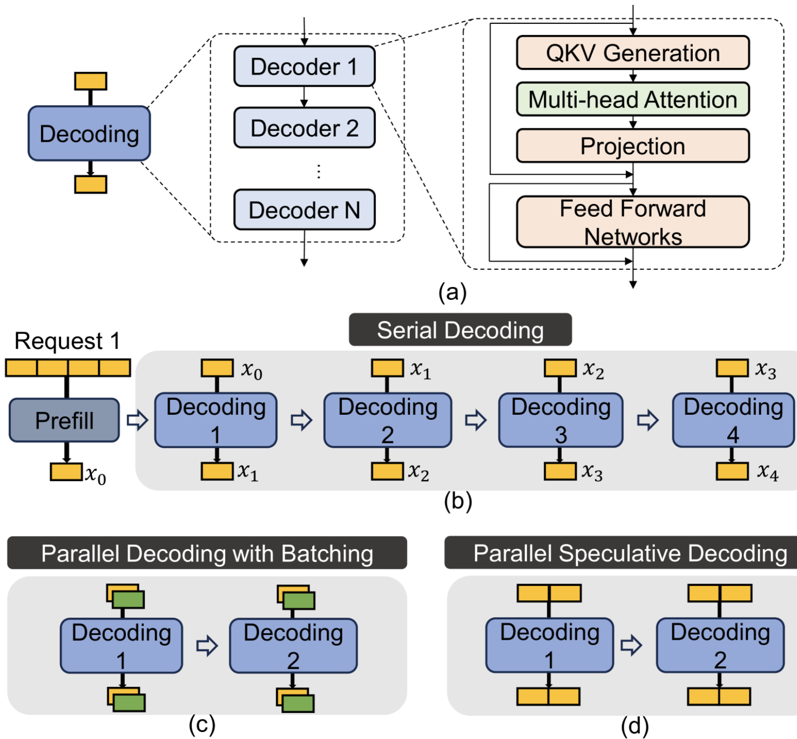

# PAPI: Exploiting Dynamic Parallelism in Large Language Model Decoding with a Processing-In-Memory-Enabled Computing System
PArallel Decoding with PIM

## “我的总结”
提出一种结合 GPU 与 PIM 的异构系统架构，用于加速 大语言模型（LLM）的解码阶段（decoding）。论文指出在实际推理服务中，请求级并行度（RLP）和 token级并行度（TLP）会动态变化，从而导致全连接层（FC）在 memory-bound 和 compute-bound 之间切换，而现有系统采用静态算子分配策略无法适应这种变化。为此，PAPI 设计了专门的 FC-PIM （专门加速 memory-bound 的全连接层计算）和 Attn-PIM 单元（用于执行 attention 计算和KV cache访问），并提出基于运行时并行度（RLP×TLP）的动态调度方法，在 GPU 和 PIM 之间自适应分配 FC 计算。
未来工作：
（1）更智能的调度算法，使用一个简单规则RLP×TLP>α 来决定 FC 层放在 GPU 还是 PIM。可以使用一些reinforcement learning方法来改善调度算法
（2）PAPI 主要优化计算位置，而没有深入优化通信。可以考虑改进 GPU-PIM 互联结构，减少通信开销

## Abstract
LLM 依赖 LLM decoding (time-consuming) to generate output tokens

前人的工作： 提高 LLM decoding by parallelism techniques (e.g. batching decoding, speculative decoding), decoding算法包括：
e.g. statically identify并映射这些不同的内核到由processing-in-memory/PIM units和computation-centric accelerators（e.g. GPU）组成的heterogeneous architecture (homogeneous/同构：全是同一种“算力单元”, 比如全 CPU 核、或全同型号 GPU)

我们观察到，LLM decoding kernel的特性（例如，内核是否为内存密集型）会dynamically change due to parameter changes，以满足用户和/或系统需求，这使得
（1）将内核静态映射到processing-in-memory/PIM units 和 computation-centric accelerators并非最优方案
（2）由于即使在内存密集型内核中也存在高度异构性（e.g. KV cache“搬得太多”, LayerNorm: “每次搬得碎且计算少”, softmax: “归约同步重”, top-k: “控制流/不规则”），one-size-fits-all approach of designing PIM units效率低下。

本文旨在加速 LLM 解码while考虑内核的 dynamically changing characteristics, 提出PAPI（基于PIM的并行解码）: a PIM-enabled heterogeneous architecture that exploits dynamic scheduling of compute-bound or memory-bound kernels to suitable hardware units. 利用 PIM 将计算密集型或内存密集型内核动态调度到合适的硬件单元。
包含两个关键机制：
（1）在线内核特性分析online kernel characterization: 以便在运行时将内核dynamically schedule to 最合适的硬件单元；
（2）a PIM-enabled heterogeneous computing system: 能够协调harmoniously orchestrate 计算密集型处理单元（GPU）和具有不同计算能力的混合 PIM 单元。

我们在三种广泛使用的 LLM（即 LLaMA-65B、GPT-3 66B 和 GPT-3 175B）上的实验结果表明，PAPI 的性能提升了 1.8x, 11.1×
与最先进的异构 LLM 加速器（即 GPU 和 PIM）和最先进的仅 PIM LLM 加速器相比，速度分别提高了 100%。

## 介绍
### 已有的
LLM推理包括两个阶段：预填充prefill和decoding。
- Prefill: 处理请求中的all input tokens，为解码阶段创建hidden states并生成第一个输出标记。
- 在常规解码阶段，模型在每次解码迭代中生成一个输出标记。占据了大部分执行 时间 [11,12]。 

为了提高解码阶段的性能，以往的研究采用了两种主要的并行解码技术：batching批处理[15,16,17] 和 speculative decoding[18,19,20,21]

定义 decoding parallelism: the number of decoding tokens that are simultaneously generated. 直接影响内存和计算资源的利用率。因此，解码过程中的某些内核会受计算资源限制，而另一些内核则会受内存资源限制。

最近的研究探索了：同时使用 PIM 单元和以计算为中心的加速器（例如 GPU）的异构架构[22,23,24,25,26] to accelerate the LLM inference process by 将计算密集型和内存密集型内核映射到以计算为中心和以内存为中心加速器。
这些工作 statically characterize LLM decoding kernels，并基于静态识别的特征，将不同类型的内核调度到不同的计算单元

### 观察 -> 改变
我们观察到，一些内核会根据 variations in decoding parallelism 动态地从计算密集型转变为内存密集型（或者反过来），因为解码并行度在运行时会动态变化。动态变化的原因：
- 计算系统中的最大解码并行度受限于请求的内存需求（取决于请求的输出长度），并且无法在执行前预测
- 最大解码并行度还会受到不同用户需求的影响，例如服务质量（QoS）。
- 一些并行技术[17,28]采用动态优化方法，在运行时调整解码并行度的配置（即batch size、speculation length）以提升系统性能（参见第3节）。我们得出结论，解码并行度的动态变化会导致采用静态调度方案的异构设计变得次优，因为它们可能会错误地将计算密集型内核调度到PIM单元，或将内存密集型内核调度到以计算为中心的加速器（例如GPU）。

本文旨在充分利用LLM推理任务中动态变化的并行特性来加速并行解码。为此，我们提出了PAPI（基于PIM的并行解码），这是一种支持PIM的异构架构，它能够将计算密集型或内存密集型内核动态调度到最适合每种内核类型的硬件单元。核心思想是通过在线识别LLM解码中的内核特性，在异构架构（由GPU和PIM单元组成）上实现在线动态任务调度。
具备三项关键技术:
- 一种动态并行感知任务调度框架，用于在运行时将内核分配到合适的计算平台。该方法采用了一种简单而有效的内核瓶颈预测器，硬件开销低。
- 设计了一种包含 PIM 单元、GPU 和主机 CPU 的异构架构，以满足不同内核不同的计算和内存需求。
- 设计了一种混合 PIM 架构，包含两种不同类型的 PIM 单元，即性能优化型 PIM 单元和内存容量优化型 PIM 单元，分别满足具有不同计算需求和内存占用的内存密集型内核的需求。

### 结果/结论
比较与 
(1) 由 AttAcc 组成的最先进的异构 LLM 加速器进行 [23] + 6 个 NVIDIA A100 GPU [29] (A100+AttAcc), 
(2) 一种由三星 HBM-PIM 组成的异构架构 [30] + NVIDIA A100 GPU（A100+HBM-PIM）
(3) 仅支持 PIM 的 LLM 加速器 AttAcc [23]
实验结果表明，PAPI 的性能比 A100+AttAcc、A100+HBM-PIM 和 AttAcc 高出 1.8×，1.9×，以及 11.1×

本文做出以下贡献。
- 观察到 LLM 解码中的并行性会动态变化，从而导致对计算能力和内存带宽的需求不断变化。
- 提出了 PAPI，一种支持 PIM 的异构计算系统，通过结合以内存为中心的 PIM 单元和以计算为中心的 GPU 和主机 CPU，来满足不同的计算和内存带宽需求。
- 提出了一种在线并行感知调度技术，该技术将具有不同且不断变化的属性的动态 LLM 解码内核映射到最合适的硬件单元，包括混合 PIM 单元。
- 评估了 PAPI，并证明它比最先进的 LLM 推理计算系统具有显著的性能和能源优势。

## 2.Background
### 2.1.LLM inference

LLM 结构包含多个基于 Transformer 的解码器。每个解码器包含四个内核：QKV (Query, Key, and Value) generation, multi-head attention, projection, feedforward networks [31].
- 这些内核可以分为两类：橙色的 <u>fully-connected/FC</u> layers 和 绿色的 <u>a multi-head attention layer</u>
- 所有内核都包含<u>general matrix-vector multiplication/ GEMV</u>计算。
 
在预填充阶段，模型同时处理输入序列中的多个词元，生成第一个输出词元。
串行解码: 包含多次解码迭代。在每次迭代中，模型将最后一个输出词元作为输入，生成一个新的输出词元。输出序列按顺序逐个生成，直到遇到<|eos|>(end of a sentence)词元 [31]。
- 与预填充阶段相比，解码阶段通常占用大部分 end-to-end inference time [21]
- 解码迭代次数取决于 the output token length。采用串行解码, generating 
K output tokens takes K decoding iterations [18]
- 在每次串行解码迭代期间，使用GPU/TPU将庞大的权重矩阵和KV矩阵从片外存储器加载到片上存储器/缓存中，这会导致大量的数据传输和性能开销。
  - 在LLM推理中，QKV生成的输出（即K矩阵和V矩阵）会被存储，因为这些输出值会在后续解码迭代中被 multi-head attention 内核多次复用。

### 2.2.LLM推理中的优化技术
有助于同时解码多个标记，从而通过生成多个标记来提高权重矩阵的数据重用，进而提高性能。

#### 2.2.1批量处理
并发处理多个输入序列。它允许通过单个解码步骤从不同的用户请求生成多个标记。这使得推理过程中能够实现请求级并行（RLP），其中 RLP 指的是并行执行的请求数量。例如，如图 1 (c) 所示，当 LLM 同时处理两个输入请求时，RLP 为 2。一种先进的批处理机制是混合连续批处理 。16，17在混合连续批处理中，系统会根据可用内存和计算资源以及传入请求的数量，在运行时动态调整批次中的请求数量。这项技术允许在无需等待批次中所有请求完成的情况下，将新请求添加到当前批次中，从而优化资源利用率并提高整体吞吐量。
2.2.2推测性解码
推测执行引入了一种新颖的并行解码机制[18，19该方法包含两个步骤：串行草稿解码和并行推测解码。首先，一个小型草稿模型高效地预测接下来的 2-10 个词元，然后将这些预测的词元与大型原始 LLM 同时验证，从而实现后续词元的并行处理。图 1 (d) 展示了 LLM 一次解码迭代中生成两个词元时的机制。推测解码实现了 LLM 推理中的词元级并行性 (TLP)。TLP 表示在一次解码迭代中同时解码的词元数量。例如，图 1 (d) 中一个请求的两个黄色词元同时解码，即 TLP = 2。
3动机
3.1LLM推断分析
我们通过评估全连接（FC）和多头注意力核的算术强度来分析LLM推理的计算和内存需求。我们改变批处理大小（启用批处理时）和推测长度（启用推测解码时）。图 2（a）显示了OPT-30B模型的屋顶线模型 [32]使用高端 NVIDIA A100 GPU  [29对于 FC 和注意力内核，在推测长度为 8 的情况下，随着批大小从 4 增加到 128，峰值计算性能达到 312 TFLOPS，峰值内存带宽达到 1935 GB/s 。我们得出两个关键观察结果。首先，当批大小较小时（例如 4、8、16），解码阶段受限于内存带宽，即注意力内核和 FC 内核都受到内存带宽的瓶颈限制。其次，当批大小为 128 时，峰值计算性能达到 312 TFLOPS，峰值内存带宽达到 1935 GB/s。
≥
32，全连接核（FC核）成为计算密集型，而注意力核成为内存密集型。全连接核的运算强度随批处理大小的增加而增加。然而，注意力核的运算强度不会随批处理大小的增加而改变，因为注意力核在批处理过程中不存在数据重用。

图 2：使用 OPT-30B 的屋顶线模型，分别采用 (a) 不同的批次大小（预测长度 = 8）和 (b) 不同的预测长度（批次大小 = 32）。点的颜色越深，平行度越高。
图 2 (b) 展示了在批处理大小为 32 的情况下，当推测长度从 2 变化到 8 时，全连接 (FC) 核和注意力核的屋顶线分析。我们观察到，注意力核和 FC 核的算术强度均随推测长度的增加而增加。在批处理大小为 32 时，当推测长度超过 6 时，FC 核的计算量达到瓶颈。相比之下，尽管注意力核的算术强度也随推测长度的增加而增加，但它仍然受内存限制。这是因为注意力核的算术强度随推测长度的增加而增加幅度很小，并且批处理对其没有影响，因为批处理主要改善的是权重数据的重用，而权重数据的重用并不影响注意力核。
3.2LLM推理中不同的并行化级别
在现实世界的 LLM 任务中，由于用户请求的变化以及为了优化性能而对推测长度进行的潜在调整，批处理大小和推测长度在运行时都会发生显著变化 。28我们详细阐述了为什么在实际场景中，LLM 推理的并行性会在运行时动态变化。
初始请求级并行度（初始 RLP）： 初始 RLP 指的是批量执行开始时的 RLP。在实际的 LLM 服务场景中，初始 RLP 可能存在显著差异，导致批处理大小变化很大。这主要有三个原因。
（a）服务级别目标（SLO）限制：提高 RLP 可以提高吞吐量，但会增加每次请求的推理延迟 [33在线服务场景下，不同的用户延迟 SLO 决定了不同的最大批处理大小。例如，DGX A100 计算 系统[34]配备 1,280 GB 内存，每批最多可支持 854 个请求，30 毫秒的 SLO 要求初始 RLP 设置为低至 22  [23]。
（b）内存容量限制：初始 RLP 也受系统内存容量的限制，特别是对于 KV 缓存存储。一个拥有 640 GB HBM 的计算系统可以容纳 282 个输入输出长度为 128 的请求，但只能容纳 18 个输入输出长度为 2048 的请求 。23。在后一种情况下，批次大小需要更小，因为较长的序列需要更多的内存容量用于多头注意力机制的 KV 缓存。
（c）动态批处理：动态批处理 [35当批次已满或超过时间限制时，系统才会开始处理该批次。因此，当请求不频繁时，采用动态批处理的LLM服务系统可能会以不同的批次大小开始处理，从而产生不同的RLP值。
运行时请求级并行性（运行时 RLP）： 运行时 RLP 指的是在执行一批请求期间的 RLP。运行时 RLP 取决于所使用的批处理机制，可以是静态批处理或混合连续批处理。17]。
传统LLM服务系统[36，35]使用静态批处理和批级调度。在这种方法中，只有当前批次中的所有请求都完成后才会处理新的请求。由于每个请求的输出长度都不同，运行时 RLP 会动态变化。如图 3所示，随着当前批次中每个请求的完成（即，随着解码迭代次数的增加），运行时 RLP 会动态减少 。37]。
混合连续批次16，17允许进行令牌级调度，即在 LLM 服务系统执行当前批次请求的同时，可以向其添加新的请求进行处理。在这种情况下，运行时 RLP 会动态调整，以尽可能提高硬件资源利用率，具体调整取决于何时以及向每个批次添加多少请求。

图 3：批次中每个请求所需的解码迭代次数，说明随着解码迭代次数的增加，剩余并行请求的数量如何变化。
词法级并行（TLP）： TLP 也可以在运行时动态调整，以增强 LLM 中的推测性解码性能 [28，38例如，先前的一项工作[28引入了一种动态推测长度优化技术，该技术在每次解码迭代期间调整推测长度。此外，批处理和推测解码需要协同优化，以提高 LLM 推理的 GPU 利用率。38例如，当批次大小较小时，可以增加推测长度以最大限度地利用资源。
我们得出结论，在实际的LLM服务场景中，批处理大小和推测长度在运行时会发生显著变化。因此，由于并行化程度的变化，全连接（FC）和注意力机制的运算强度也会动态变化。所以，当在以计算为中心的系统（例如GPU）中执行时，全连接和注意力机制可能成为计算密集型或内存密集型机制。我们的分析得出两个关键结论。
关键见解 1. LLM 服务需要异构计算架构，具有先进的计算单元，可提供不同的计算吞吐量和内存带宽能力，以满足内核不同的算术强度。
关键见解 2. LLM 服务需要动态调度方法将 FC 内核映射到不同的计算单元，因为 FC 内核在运行时可能会在计算密集型和内存密集型之间切换。
3.3现有内存处理架构在LLM推理方面的局限性
计算单元，例如 GPU 和神经处理单元 (NPU)，被广泛用于 LLM 服务系统。最近的研究（例如，[23，25，22，24，26，39，40，41，42，43，12]）探索内存处理（PIM）计算范式（例如，[44，45，46，47，48，49，50，51，52在LLM推理中， PIM通过集成处理核心来缓解内存密集型内核（例如注意力内核）的数据移动瓶颈。PIM通过将处理核心集成到内存单元中，提供高内存带宽，从而减轻低运算强度内核中的数据移动瓶颈。
一些先前的工作 [23，25，22，24，26本文提出了一种支持PIM的LLM异构架构。这些架构既包含高性能的计算型处理器（例如GPU），也包含具有极高内存访问带宽的PIM设备。这些工作在计算型处理器或内存型PIM设备上运行LLM内核，并展示了相比于通用系统（例如仅使用计算型加速器（例如GPU）运行端到端LLM推理）的显著性能优势。然而，这些先前的工作仍然存在两个主要缺陷。
缺点 1. 以往的工作将全连接 (FC) 和注意力核静态地分配给以计算为中心的处理器 (GPU) 或支持 PIM 的计算设备。我们的分析表明，将内核动态分配给不同的计算设备是必要的，因为 LLM 内核的运算强度各不相同，例如，在 GPU 中，FC 内核可能受计算限制或内存限制，具体取决于当前使用的推测长度和批处理大小。具体而言，AttAcc [23始终将所有注意力内核卸载到所提出的 PIM 设备，并将所有 FC 内核卸载到 GPU。IANUS [25SpecPIM将所有 FC 内核静态映射到 PIM，并将注意力内核静态映射到 NPU 。24本文提出了一种分配方案，该方案可在高性能处理器和 PIM 设备上同时执行注意力机制和全连接（FC）内核。然而，该方案仅适用于固定的批处理大小和推测长度。我们认为，这些先前的工作不足以满足实际 LLM 服务场景中不断变化的计算和内存需求。它们提出的静态设计中，全连接和注意力机制内核始终映射到相同的计算硬件；即使内核在运行时表现出不同的计算和内存需求。
为了定量地展示先前基于 PIM 的 LLM 推理方案的局限性，我们使用 NVIDIA A100 GPU 评估了一个 FC 内核的执行时间（延迟）[29]，三星的HBM-PIM架构[30]，以及基于 PIM 的 LLM 的最新工作，AttAcc [23（第 7 节详细介绍了我们的评估方法）。图 4显示了当批处理大小和推测长度发生变化时，FC 内核的延迟（已归一化至 A100 GPU）。我们观察到，在并行化程度较低的配置中，例如批处理大小为 1、推测长度为 8 或批处理大小为 4、推测长度为 2 时，基于 PIM 的架构（即 HBM-PIM 和 AttAcc）的性能优于 A100 GPU。相反，在并行化程度较高的配置中，例如批处理大小为 16 或更大时，A100 GPU 的性能显著优于基于 PIM 的架构，执行时间更短。然而，RLP 和 TLP 并非预先（静态）已知：它们会动态变化，难以预测其变化趋势。因此，我们需要动态地决定使用哪种计算硬件来执行 FC 内核。

图 4：不同并行化级别（不同批次大小和推测长度）下 LLM 推理中 FC 核的归一化延迟。
不足之处2： 以往的研究仅支持一种具备特定计算吞吐量和内存带宽能力的PIM（性能信息管理）计算设备。我们的分析表明，尽管FC内核和注意力机制内核在GPU中都属于内存密集型内核，需要采用PIM解决方案，但它们的运算强度以及对计算和内存带宽的需求却截然不同。例如，如图 2所示，在批处理大小为4、推测长度为8的情况下，FC的运算强度为31.7 FLOPs/Byte，而注意力机制的运算强度为7.0 FLOPs/Byte。因此，假设计算硬件具有一定的计算吞吐量，注意力机制所需的内存带宽约为FC的4.5倍。这表明，PIM计算设备需要提供不同的计算和内存带宽能力，才能高效地执行这两种不同类型的LLM内核。我们的工作首次确定了两种 LLM 内核的这一特性，而先前的工作使用具有固定计算和内存带宽能力的 PIM 设备，这使得它们无法有效地满足注意力内核和 FC 内核的不同且动态变化的需求。

图 5：PAPI 计算系统概述及其动态并行感知调度器的示例。
3.4我们的目标
我们的目标是设计一个多功能的计算平台，以满足实际逻辑逻辑推理中不同并行化级别以及动态变化的计算和内存需求。为此，我们提出：（1）一种异构架构，集成了以内存为中心的PIM单元和以计算为中心的GPU及主机CPU，每个单元都具有不同的计算吞吐量和内存带宽特性；（2）一种并行感知调度技术，能够适应运行时并行化的变化，并智能地、动态地将全连接（FC）内核和注意力内核分配给平台中最合适的硬件单元。
4PAPI：概述
鉴于LLM推理在运行时会呈现不同的并行化程度，因此需要一种智能的动态调度策略，以便在给定时间点为给定内核选择最合适的计算硬件。关键挑战在于设计一种内核卸载和分配方案，该方案能够以低成本（就延迟和能耗而言）在线监控动态并行性，并选择最合适的计算硬件，从而充分利用可用的硬件资源。
4.1PAPI：关键组成部分
我们提出了PAPI架构和框架。图 5展示了PAPI框架的概览。PAPI包含三个关键组件，下文将对此进行解释。
异构架构。 我们提出了一种异构架构，以有效满足LLM计算密集型和内存密集型内核的需求。该架构包括：(1)主机CPU；(2)带有PIM内存单元的高性能处理器（FC-PIM）；以及(3)物理分离（即解耦）的PIM单元（Attn-PIM）。高性能处理器包括处理单元（以下简称PU），例如GPU张量核心 [53]、PIM 内存单元（即基于 HBM 的 PIM 设备）以及硬件调度器。在我们的评估中，我们使用 GPU 张量核心作为 PU，但任何其他专为计算密集型内核设计的高性能处理器（例如 TPU  [54]或 NPU  [55也可以使用] ) 进行此设计。主机 CPU 向高性能处理器和物理上分离的 Attn-PIM 设备发送指令，这些设备与高性能处理器是分离的。
混合PIM单元。 我们提出了两种类型的PIM单元，以满足LLM中全连接（FC）和注意力核的不同并行化水平。FC-PIM单元提供相对较高的计算能力，以满足FC核的需求，而Attn-PIM单元提供更大的内存容量，以满足注意力核的需求。混合PIM单元旨在克服先前LLM PIM设计的局限性（例如，[30，56，23通常情况下，它们只支持一种具有固定计算能力的PIM单元类型。PAPI将FC内核和注意力内核分布在不同的PIM设备上。由于注意力内核始终受限于内存，因此它们被分配给Attn-PIM设备。FC内核可以是计算密集型的，也可以是内存密集型的，因此调度器可以动态地将它们分配给PU或FC-PIM单元。
动态并行感知调度。 如第 3.2节所述，我们需要识别 FC 层是否受内存限制，并动态地将其卸载到 FC-PIM 单元或高性能处理器的 PU 上。而注意力内核始终受内存限制，只能在 Attn-PIM 单元上运行。我们引入了一个硬件调度器（图 5 (a) 中的绿色模块），用于监控运行时并行化程度的变化并实现动态调度。当并行化程度发生变化时，我们的调度器会执行一个低成本的识别步骤，并将 FC 内核卸载到最合适的计算硬件上。当调度器识别出 FC 内核受内存限制时，它会在 FC-PIM 设备上执行 FC。当它识别出 FC 内核受计算限制时，它会在高性能处理器的 PU 上执行 FC。在后一种情况下，FC-PIM 内存单元用作主内存来保存权重参数，这些参数由 PU 加载和处理。图 5 (d) 展示了 PAPI 动态监控的一个示例。每当 FC 内核的并行化级别发生变化时，我们的动态监控框架就会介入，识别内存密集型或计算密集型内核，并根据需要将它们重新分配到不同的单元。
5PAPI动态调度
我们提出了一种高效的调度机制，可以在运行时将 FC 内核卸载到 PU 或 FC-PIM 单元，从而实现低延迟和低能耗。本节首先解释该调度机制如何判断 FC 内核是否受内存限制，然后详细介绍运行时调度的具体实现。
5.1FC核的内存有限性识别
我们通过估计 FC 核的算术强度来判断它是否受内存限制。假设 FC 核的权重矩阵维度为
（
h
，
h
）
给定的输入是
（
拉
⁢
L
⁢
P
×
T
⁢
L
⁢
P
，
h
）
， 在哪里
h
是 LLM 结构中的隐藏维度。FC 核的算术强度可以按如下方式计算：
	人工智能
=
#
⁢
失败
#
⁢
字节
=
拉
⁢
L
⁢
P
×
T
⁢
L
⁢
P
×
h
2
×
2
（
2
×
拉
⁢
L
⁢
P
×
T
⁢
L
⁢
P
×
h
+
h
2
）
×
2		（1）
在最先进的LLM中，隐藏维度
h
通常规模很大，以支持其高级自然语言处理任务[4]。 例如，
h
=
12288
在 GPT-3 175B 模型中 [32]，算术强度可以按如下方式估算：
	人工智能
≈
拉
⁢
L
⁢
P
×
T
⁢
L
⁢
P		（2）
因此，我们可以利用
拉
⁢
L
⁢
P
×
T
⁢
L
⁢
P
估计 FC 核的算术强度，其中
拉
⁢
L
⁢
P
和
T
⁢
L
⁢
P
在运行时已知。
为了评估我们算术强度估计的准确性，我们使用不同的 RLP 和 TLP 配置，对 GPT-3 66B 模型中的 FC 内核进行了评估。图 6显示了实际获得的算术强度和我们估计的值。在大多数情况下，我们的估计值与实际算术强度非常接近。当并行化级别非常高时（例如，RLP=128），估计值略高于实际算术强度。在这种情况下，FC 内核的实际算术强度超过了高性能处理器的 PU 的最大理论计算吞吐量。因此，这种微小的偏差不会影响卸载决策，从而能够正确地将 FC 内核识别为计算密集型内核，并确保准确的调度。

图 6：GPT-3 66B 模型中 FC 核的实际测量算术强度和估计算术强度。
5.2运行时调度实现
基于对运算强度的估计，我们识别出内存密集型或计算密集型的FC内核，并在运行时将其动态调度到最合适的计算硬件单元。调度过程在主机CPU上分两步执行：（a）初始调度和（b）运行时调度。
5.2.1初步排期
在初始调度步骤中，我们决定在 LLM 服务开始之前将 FC 内核卸载到 PU 或 FC-PIM 单元。
拉
⁢
L
⁢
P
设置为批次大小，并且
T
⁢
L
⁢
P
设置为系统定义的推测长度。我们乘以
拉
⁢
L
⁢
P
经过
T
⁢
L
⁢
P
估算算术强度并将其与记忆有限度阈值进行比较
α
做出卸载决定。如果估计值大于
α
如果 FC 内核被评估为计算密集型，则将其卸载到 PU 上执行；否则，将其评估为内存密集型，并在 FC-PIM 单元上执行。阈值
α
这是通过离线迭代评估确定的，其中我们在不同的并行化级别下分别在 PIM 和 PU 单元上运行 FC 内核，并使用观察到的执行时间来确定最佳方案。
α
选择。
5.2.2运行时调度
在运行时调度中，我们会监控并行度的变化，预测当前的运算强度，并决定是否将 FC 内核重新调度到不同的计算硬件上（例如，从 PU 到 FC-PIM 单元，反之亦然）。我们使用令牌级调度方案来跟踪并行度的变化，并根据估计的运算强度做出实时决策。该过程包含四个步骤，我们将在下文中进行描述。
首先，每次解码后，我们将当前批次中所有请求的输出标记收集到一个向量中。其次，我们统计该向量中<|eos|>标记的数量，以跟踪变化。
拉
⁢
L
⁢
P
如果计数大于零，则表示某些请求已完成，释放分配给 Attn-PIM 的相应 PIM 资源。
T
⁢
L
⁢
P
通常是初始设置，并且在运行时不会频繁更改，因此我们会监控以下方面的变化：
T
⁢
L
⁢
P
采用直接的方法：
T
⁢
L
⁢
P
该值存储在专用寄存器中，如果主机 CPU 上运行的系统软件对其进行修改
T
⁢
L
⁢
P
第三，主机CPU通知（发送指令）PAPI系统相应地更新寄存器。
拉
⁢
L
⁢
P
×
T
⁢
L
⁢
P
预测下一次解码的算术强度。第四，我们将估计值与内存限制阈值进行比较。
α
决定是否需要将 FC 内核从 PU/FC-PIM 单元重新调度到 FC-PIM/PU 单元。图 5 (d) 展示了我们提出的动态调度技术的一个示例，该技术能够根据工作负载的实时需求，在我们提出的架构中最合适的硬件单元上执行 LLM 解码，从而显著优化 LLM 推理的性能。
6PAPI架构
6.1FC-PIM 设计
为了满足 FC 内核的计算需求，我们需要设计一个具有较高计算并行性的 PIM 解决方案，同时满足必要的功耗约束。我们修改并使用了一个开源的基于 HBM 的 PIM 模拟器[23]基于 Ramulator 2.0  [57，58]评估不同 PIM 配置下的能耗和功率。
我们首先考察传统PIM设计中的能量分解（例如，  [23] )，它将每个内存库集成一个处理核心，称为 1P1B。PIM 执行的能耗来自三个部分：
D
⁢
拉
⁢
一个
⁢
M
⁢
一个
⁢
c
⁢
c
⁢
e
⁢
s
⁢
s
，
T
⁢
r
⁢
一个
⁢
n
⁢
s
⁢
f
⁢
e
⁢
r
， 和
C
⁢
o
⁢
米
⁢
p
⁢
你
⁢
t
⁢
一个
⁢
t
⁢
我
⁢
o
⁢
n
。
D
⁢
拉
⁢
一个
⁢
M
⁢
一个
⁢
c
⁢
c
⁢
e
⁢
s
⁢
s
包括激活和预充电 HBM DRAM 行以读取重量数据所需的能量消耗。 
T
⁢
r
⁢
一个
⁢
n
⁢
s
⁢
f
⁢
e
⁢
r
包括将激活数据从缓冲芯片经由 TSV、全局控制器和存储组控制器传输到处理核心的能耗。 
C
⁢
o
⁢
米
⁢
p
⁢
你
⁢
t
⁢
一个
⁢
t
⁢
我
⁢
o
⁢
n
包括处理核心的浮点乘法单元 (FPU) 的计算能耗。如图 7 (a) 所示，PIM 执行过程中的大部分能耗都消耗在以下方面：
D
⁢
拉
⁢
一个
⁢
M
⁢
一个
⁢
c
⁢
c
⁢
e
⁢
s
⁢
s
其中占总能耗的 96.7%，比 Q 向量（活化数据）大1 。

图 7：(a) PIM 在不进行 DRAM 数据重用的情况下执行 FC 内核的能耗分解。(b) PIM 在一次 DRAM 访问（即激活的 DRAM 行）用于计算 64 次（即数据重用级别 = 64）的情况下执行 FC 内核的能耗分解。(c) PIM 架构在不同数据重用级别和每个存储体不同 FPU 数量下的功耗。
基于以上分析，从DRAM中一次访问数据并将其用于多次计算可以显著降低能耗。如果数据可以从DRAM中一次访问并用于多次计算，则PIM执行的总能耗可以显著降低。图 7 (b)展示了从DRAM中一次获取数据并将其用于64次FC内核计算时PIM的能耗分解情况。
D
⁢
拉
⁢
一个
⁢
M
⁢
一个
⁢
c
⁢
c
⁢
e
⁢
s
⁢
s
整体能耗降低至 33.1%。这种方法为我们提供了一个新的机会，可以提升近银行 PIM 的并行计算吞吐量。通过降低 DRAM 访问的能耗，我们可以为 PIM 内核腾出额外的能源预算。
如第 2 节所述，并行技术（批处理和推测解码）使得 LLM 解码中能够实现数据重用，从而通过减少延迟来实现并行 PIM 执行。
D
⁢
拉
⁢
一个
⁢
M
⁢
一个
⁢
c
⁢
c
⁢
e
⁢
s
⁢
s
我们分析了不同数据重用级别下的功耗，其中单个 DRAM 访问被多次计算重复使用。我们探索了不同的 PIM 配置，即每个 DRAM 存储体中不同数量的 FPU。图 7 (c) 显示了我们的结果。
x
⁢
P
⁢
是
⁢
B
表示每个存储体包含 x 个 FPU。横轴表示数据重用级别，它指示单个 DRAM 行用于 FC 内核计算的次数。纵轴表示功耗。我们观察到，更高的数据重用级别会导致功耗显著降低。具体来说，当数据重用级别为
≥
4，4P1B 的功耗显著低于未启用数据重用（即数据重用 = 1）的情况，并满足 HBM 的功耗预算。2因此，利用数据重用可以在满足功耗限制的前提下，使每个 DRAM 存储体使用更多的 FPU。
除了功耗限制外，单个HBM芯片的面积限制也是实现高度并行PIM设计的一大障碍。因此，我们必须确保包含额外FPU在内的HBM-PIM芯片总面积保持在单个HBM芯片允许的最大面积范围内。为了在面积受限的HBM芯片内容纳额外的FPU，我们减少了存储容量，从而为FPU腾出空间。假设每个支持PIM的HBM芯片都具有……
米
DRAM 存储体，每个 DRAM 存储体采用
n
浮点运算单元（FPU）。内存和浮点运算单元的总面积应满足以下条件：
	米
⁢
（
n
×
一个
F
⁢
P
⁢
U
+
一个
b
⁢
一个
⁢
n
⁢
k
）
≤
一个
M
⁢
一个
⁢
x		（3）
这个方程式使我们能够计算
米
使用 nP1B PIM 配置，在支持 PIM 的 HBM 芯片中获得可实现的最大容量。
我们使用分析工具 CACTI-3DD [60]估算面积。一个 HBM 银行的面积
一个
b
⁢
一个
⁢
n
⁢
k
采用 22nm 技术节点时，面积为 0.83mm²³  。根据先前的工作，单个 HBM 芯片的面积限制为 121 mm² [61一个FPU的面积
一个
F
⁢
P
⁢
U
为 0.1025 mm² [23因此，4P1B PIM 配置的方程如下：
	米
⁢
（
0.1025
×
4
+
0.83
）
≤
121		（4）
因此，存储器组的最大数量必须小于 97。在我们的设计中，每个 HBM 存储单元使用 96 个存储组，即 8 高 HBM 堆叠中的 3 个存储组组 (BG)，以满足具有 4P1B PIM 配置的单个 HBM 芯片的面积限制，如图 5 (b) 所示。
6.2致 PIM 设计
为了应对全连接（FC）和注意力内核在运算强度、计算需求和内存占用方面的差异，同时确保硬件资源的高利用率，我们提出了专用的注意力-性能信息管理（Attn-PIM）单元，该单元独立于全连接-性能信息管理（FC-PIM）单元（如第6.1节所述）。Attn-PIM单元通过互连与高性能处理器分离。这种Attn-PIM的分离式设计使我们能够应对LLM的键值缓存日益增长的内存占用需求，我们将在下文中进行解释。
我们发现，LLM 的 FC 内核计算强度更高，延迟也明显高于注意力内核，而注意力内核的内存占用量更大。因此，在面积预算固定的情况下，FC-PIM 需要更高的计算能力，而注意力内核则不需要那么高的计算能力。为了满足这些限制，我们为 FC-PIM 设备分配了高执行并行度的组件，即每个 DRAM 存储体配备 4 个 FPU（如 6.1 节所述）。相比之下，我们分配了更多数量的 Attn-PIM 设备，每个设备的执行并行度较低，每两个存储体使用 1 个 FPU，分别如图 5 (b) 和 (c) 所示。在 Attn-PIM 设备中，两个存储体使用单个 FPU 可以确保功耗控制在 HBM 的功耗限制范围内。对于推测长度为 1 的注意力内核，一个 666 MHz、每个存储体带宽为 20.8 MB/s 的 FPU (1P1B) 即可满足内核的计算强度。然而，由于该内核缺乏数据重用，1P1B 的功耗超过了功耗预算，如图 7 (c) 所示。因此，我们为每个 Attn-PIM 设备采用 1P2B 配置，以确保功耗控制在限制范围内。
在配置好 FC-PIM 和 Attn-PIM 硬件设计后，我们确定整个系统高效运行 LLM 推理所需的两种 PIM 设备的数量。我们根据 LLM 推理的容量需求来配置系统中 PIM 设备的总数。FC 内核的内存容量需求仅取决于模型大小，并且在运行时保持不变。然而，注意力内核所需的内存容量随序列长度线性增加。为了支持序列长度更长的请求（即产生更多输出标记的请求），我们将 Attn-PIM 设备从高性能处理器中分离出来，从而能够灵活地容纳大量占用较大内存的 Attn-PIM 设备。
总的来说，通过分别优化 FC-PIM 和 Attn-PIM 设备的并行计算和内存容量能力，并为我们提出的两种 PIM 设备在系统中设置不同数量的设备，我们可以满足 FC 内核更高的计算和内存带宽需求，同时也能满足注意力内核更高的内存容量和更低的计算需求。
6.3系统集成
图 5 (a) 展示了 Attn-PIM 设备与高性能处理器和主机 CPU 之间的互连网络概览，其中高性能处理器由 FC-PIM 设备和处理单元组成。由于需要传输大量权重参数，FC-PIM 设备需要与处理单元进行高速通信。因此，我们选择了 NVLink 等高速互连技术 。62用于将 FC-PIM 设备与处理单元连接。NVLink提供所需的数据吞吐量，以确保 FC 内核能够高效执行，而不会受到数据传输速度的瓶颈限制。相比之下，注意力内核主要涉及小数据传输，例如字节级 Q 向量，因此可以使用 PCIe（外围组件互连高速）等标准互连 。63或CXL（Compute Express Link）  [64根据设备数量， PCIe总线理论上最多可支持 32 个设备 。65]，而 CXL 可扩展至 4,096 个设备 [64这些传统链路为注意力核提供了足够的带宽，并且比高速链路更具成本效益。
6.4跨 PIM 设备的数据分区
对于注意力核，我们将注意力头分布到 Attn-PIM 单元中，每个注意力头分配给一个单独的 HBM 设备。我们采用了来自 AttAcc 的注意力映射方案 [23在HBM设备上，这确保了 PIM 架构中高效的数据传输和并行性。具体来说，
K
T
矩阵按伪通道和银行组层面的列进行划分，按银行和乘数层面的行进行划分。相反，
V
矩阵按伪通道和银行组级别按行划分，按银行和乘数级别按列划分。
对于 FC 内核，首先将大型权重矩阵分割成较小的二维块，每个块映射到一个 HBM 设备。在伪通道、存储组和存储层级别，这些权重块的划分方式与上述类似。
K
T
注意力核中的矩阵：按伪通道和银行组级别按列，按银行级别按行。
6.5实用性和架构可扩展性
针对不同工作负载的互补型 PIM 单元。 我们设计了不同的 FC-PIM 和 Attn-PIM 设备，以应对 LLM 中不同的计算和内存访问模式，同时保持硬件的实用性。FC-PIM 和 Attn-PIM 设备共享相同的 bank 级计算架构和内存层次结构。主要区别在于每个 bank 的处理单元 (PU) 数量，这是根据 LLM 任务的具体计算特性量身定制的。Attn-PIM 针对内存密集型操作进行了优化，每个 bank 使用较少的 PU 来高效处理内存密集型任务；而 FC-PIM 则专为计算密集型操作（例如全连接 (FC) 层）而设计，每个 bank 使用更多的 PU 以实现更高的计算吞吐量。
Attn-PIM 的设计已被证明可在工业原型和产品中实现，例如 UPMEM  [66，67，68，69，70，71，72，73，74]和 HBM-PIM  [30，75将其集成到我们的系统中，可确保高效处理内存密集型任务，使其成为 LLM 工作负载的合适解决方案。
另一方面，FC-PIM 利用每个存储体中更多的 PU 来增强并行执行并优化 FC 层的计算吞吐量，同时保持在 HBM 的功率限制之内。
通过采用共享的HBM-PIM计算基板，FC-PIM和Attn-PIM均受益于统一的设计，无需对DRAM核心阵列进行任何修改。计算逻辑嵌入在外围电路中，最大限度地减少了面积开销，同时确保了与现有HBM技术的兼容性。我们相信，这种方法简化了硬件集成并提供了可扩展性，使PIM技术更容易应用于LLM加速器的大规模部署。
新兴LLM模型的部署。LLM 的快速发展，特别是专家混合（MoE）模型 [76，77，78，这为硬件加速器带来了新的挑战和机遇。多模型（MoE）在推理过程中仅激活部分专家，利用稀疏性来降低计算需求。这一特性有利于硬件加速器，因为它能够更有效地利用资源。
FC-PIM 特别适合利用 MoE 架构固有的稀疏性。在 MoE 模型中，不同的专家会根据输入被激活，而这些激活的稀疏性为优化计算提供了绝佳的机会。FC-PIM 通过将来自不同专家的权重切片存储在同一个 DRAM 存储体中，可以高效地执行这些稀疏操作。这使得系统能够最大限度地减少空闲的 FPU，否则由于 MoE 模型的稀疏性，这些 FPU 将无法被利用。此外，通过减少内存和计算单元之间不必要的数据传输，FC-PIM 有助于降低 MoE 推理的能耗和延迟。这些设计选择确保 PAPI 能够有效地加速基于 MoE 的模型，使其成为未来 LLM 架构的可行解决方案。
总之，在 PAPI 架构中实际应用 FC-PIM 和 Attn-PIM，可为现代 LLM 工作负载提供可扩展且节能的解决方案。通过利用这两种 PIM 器件的互补优势，并满足 MoE 等新兴 LLM 模型的特定需求，PAPI 完全有能力为未来各种 LLM 应用提供高性能加速。
7评估
7.1评估方法
比较要点和仿真方法。我们将 PAPI 与三个最先进的系统进行比较：（a）A100+AttAcc：一个具有 6 个 NVIDIA A100 GPU 的异构计算平台 [29]和基于 AttAcc PIM 的单元（每个 DRAM 存储体一个 FPU 单元，即 1P1B 配置），这是先前工作提出的最先进的设计[23]。所有 FC 内核计算均在 GPU 上执行，注意力内核计算由基于 AttAcc PIM 的单元处理；（b）A100+HBM-PIM：一个集成计算平台，包含 6 个 NVIDIA A100 GPU 和 HBM-PIM 设备。HBM-PIM  [30]是三星生产的商用 PIM 设备，每 2 个 DRAM 存储体配备一个 FPU 单元（即 1P2B 配置）；（c）AttAcc-only：仅包含 PIM 的计算平台，采用基于 AttAcc PIM 的单元 [23]，其中全连接（FC）和注意力核的所有计算都在PIM单元上执行。在PAPI设计中，FC-PIM设备的容量为12 GB，而所有其他HBM设备（包括PAPI中的Attn-PIM设备）的容量为16 GB。因此，PAPI中单个GPU的显存为60 GB，而不是A100 GPU的80 GB，需要六个GPU才能容纳GPT-3 175B的模型参数（需要350 GB内存）。为了公平比较，每个计算系统都有90个HBM设备，其中30个用于存储FC核的权重参数，60个用于存储注意力核的权重参数。每个GPU包含5个通过NVLink连接的HBM设备 。62]，对应于 A100 GPU 的 80GB GPU 显存。实验中使用的所有 HBM 均为 HBM3  [59每个引脚传输速率为 5.2Gbps，运行频率为 333MHz。我们基于 Ramulator2 开发了一个模拟器 。57]（新版本的 Ramulator  [58]）和 AttAcc  [23]评估 PAPI 计算平台的性能和能源效率，包括基于 GPU 和 PIM 的组件。
工作负载。我们评估了三种基于Transformer的LLM，LLaMA-65B  [79]，GPT-3 66B  [32]，以及 GPT-3 175B  [32]，使用 FP16 数据类型。我们使用 Dolly 数据集中的创意写作和一般问答任务 [80Dolly数据集是一个开源数据集，包含数千名 Databricks 员工在 InstructGPT 中概述的几个行为类别中生成的指令遵循记录 。81我们在实验中采用静态批处理，并改变初始请求级别的并行度（批大小）。通过在真实数据集上评估我们提出的设计，我们可以测试不同输入输出序列长度下的性能和能耗，同时适应运行时观察到的动态并行化水平。

图 8：在 Dolly 创意写作数据集上，对四种评估设计方案进行了端到端加速比（上图）和能效（下图）比较。数值已归一化至 A100+AttAcc。
7.2端到端性能和能源效率
性能加速。图 8 (a) 显示了所有四个评估设计在解码步骤中使用不同并行化级别的端到端性能，每个模型的批处理大小分别为 4、16 或 64，推测长度分别为 1、2 或 4。结果已归一化至 A100+AttAcc 基线。
我们得出三点观察结果。首先，PAPI 相对于 A100+AttAcc、A100+HBM-PIM 和仅使用 AttAcc 的设计分别实现了 1.8 倍、1.9 倍和 11.1 倍的加速。这是因为 PAPI 能够动态地在 GPU 和 PIM 之间调度任务，在特定时间点将每个任务卸载到最合适的计算硬件上，并且所提出的混合 PIM 架构可以提供不同级别的执行并行性，以满足全连接 (FC) 内核和注意力机制的不同需求。其次，在大多数并行化设置下，仅使用 AttAcc 的方案性能不如 PAPI，也不如 A100+AttAcc。这有两个原因。(1) 仅使用 AttAcc 的方案由于仅使用 PIM 单元，计算吞吐量有限。稍后（7.4节），我们将比较具有不同并行计算能力的 PIM 解决方案的性能。 (2) 在我们实验中使用的并行设置下，FC 内核的计算量更大，因此无法从仅使用 PIM 的解决方案中获益（这种方案更适合内存密集型内核）。第三，A100+AttAcc 与 A100+HBM-PIM 的性能相近，因为它们之间的唯一区别在于注意力内核的执行方式，前者使用 AttAcc，后者使用 HBM-PIM。然而，注意力内核在 PIM 上的执行时间相对于整体运行时间而言非常短，因此性能差异很小。
图 9 (a) 展示了三种设计在 Dolly general-qa 数据集上的端到端延迟。PAPI 相对于 A100+AttAcc、A100+HBM-PIM 和仅使用 AttAcc 的方案分别实现了 1.7 倍、1.7 倍和 8.1 倍的加速，但低于其在 Dolly creative-writing 数据集上的加速比。这主要有两个原因：(i) creative-writing 数据集的输出长度通常更长，使得解码阶段成为端到端性能的更大瓶颈，因此 PAPI 的加速效果更为显著。(ii) creative-writing 数据集较长的输出长度导致并行化级别的动态变化更为显著，从而使 PAPI 能够进一步提升性能，优于之前的方案。
我们得出结论，在各种真实世界的配置设置（推测长度、批大小）和使用不同的真实数据集时，PAPI 在 LLM 推理方面比最先进的基于 PIM 的设计提供了显著的性能优势。
能效。图 8 (b) 和  图9 (b) 展示了创意写作和通用问答数据集的端到端能效，并以 A100+AttAcc 系统为基准进行了归一化。与 A100+AttAcc 相比，PAPI 在这两个数据集上的平均能效分别提高了 3.4 倍和 3.1 倍。这是因为 A100+AttAcc 在耗能较高的 A100 GPU 上执行 FC 内核，而 PAPI 将这些内核的部分运算卸载到 FC-PIM 设备上，从而通过减少数据移动和利用内存中的低功耗处理核心来降低能耗。与仅使用 AttAcc 相比，PAPI 在创意写作和通用问答数据集上的能效分别提高了 1.15 倍和 1.01 倍，低于 PAPI 相对于 A100+AttAcc 的提升幅度。这是因为 PAPI 会动态地将 FC 内核调度到耗能较高的 GPU 核心和能效较低的 PIM 核心上。虽然 GPU 执行比仅使用 AttAcc 模式消耗更多能量，但 PAPI 通过重用 DRAM 数据访问降低了 PIM 的能耗，从而比仅使用 AttAcc 模式节省了少量能量。
我们得出结论，在不同的实际配置设置和数据集上，PAPI 比最先进的 PIM 系统提高了能源效率。

图 9：对 GPT-3 175B 的 Dolly general-qa 数据集上的三种评估设计进行端到端加速 (a) 和能效 (b) 比较。
7.3对并行化程度的敏感性
我们使用 LLaMA-65B 模型在创意写作数据集上分析了三种评估设计在不同 RLP 和 TLP 值下的性能。
图 10 (a) 展示了三种设计在批处理大小从 4 到 128 变化时的性能，以探究 RLP 的影响，其中推测长度固定为 1。当 RLP 相对较低时（例如批处理大小为 4），仅使用AttAcc的性能优于 A100+AttAcc。随着 RLP 的增加，仅使用 AttAcc 的执行时间显著增加，因为 PIM 设备无法有效满足 FC 内核的大量计算需求，导致其性能远逊于 A100+AttAcc。在所有 RLP 设置下，PAPI 的性能均优于目前最先进的基于 PIM 的系统。
图10 (b) 展示了三种设计在预测长度从 1 到 8 变化时的性能， 以分析不同的 TLP 级别，同时保持批处理大小为 4。与 A100+AttAcc 和仅使用 AttAcc 的方案相比，PAPI 平均分别实现了 1.5 倍和 3.0 倍的加速。随着 TLP 的增加，PAPI 相对于 A100+AttAcc 的加速比逐渐降低，这是因为随着 TLP 的增加，PAPI 会将更多的 FC 内核卸载到 GPU 上。我们预期，如果 TLP 足够大，PAPI 会将所有 FC 内核都分配给 GPU，从而使 PAPI 的性能收敛到与 A100+AttAcc 相同的水平。

图 10：端到端加速，(a) 不同的批次大小（推测长度=1），以及 (b) 不同的推测长度（批次大小=4）；针对 LLaMA-65B。
7.4PAPI性能分析
为了分析我们提出的混合PIM设计在PAPI中的优势，我们比较了两种仅使用PIM的架构的性能：（i）仅使用AttAcc的架构和（ii）我们提出的仅使用Attn-PIM和FC-PIM器件（但不包含A100）的PIM架构。为了公平起见，我们使用了相同数量的PIM器件和互连设置。我们仅评估解码阶段（因为预填充阶段受计算资源限制，需要在GPU平台上执行）。图 11展示了使用Dolly创意写作数据集时，我们提出的仅使用PIM的PAPI设计相对于仅使用AttAcc的架构的加速比。我们的PIM设计平均实现了2.3倍的加速比。我们观察到，在更高的并行化级别下，我们的 PIM 设计具有更高的加速比：例如，当批处理大小为 4 且推测长度为 1 时，加速比为 1.6 倍；而当批处理大小为 64 且推测长度为 4（并行度更高）时，仅使用 PIM 的 PAPI 的加速比可提升至 2.7 倍。这是因为，随着并行度的增加，FC 内核的计算量也随之增加，需要更多的计算能力。与仅使用 AttAcc 的 PAPI 相比，拥有更多处理单元 (PU) 的 PAPI 能够更好地提供所需的计算能力。此外，FC 内核占据了大部分执行时间，因此提高其性能对整体加速比的影响最大。

图 11：在 Dolly 创意写作数据集的解码阶段，仅使用 PIM 的 PAPI 比仅使用 AttAcc 的性能更快。
图 12展示了仅使用 AttAcc 的系统和仅使用 PIM 的 PAPI 系统（分别搭载 Attn-PIM 和 FC-PIM 设备）的每令牌执行时间细分。我们得出四个关键观察结果。首先，FC 内核占据了总执行时间的大部分。因此，在 PIM 硬件中启用更高的执行并行性（如 PAPI 使用 FC-PIM 时所做的那样）对于有效满足 FC 内核的高计算需求至关重要。其次，仅使用 PIM 的 PAPI 设计在处理 FC 内核时速度提升了 2.9 倍。第三，由于我们选择的设计方案降低了 FPU 面积开销，注意力内核在 Attn-PIM (1P2B) 上的运行速度比仅使用 AttAcc (1P1B) 的系统慢 1.7 倍。第四，在解码阶段，通信占用了总执行时间的 28.2%；因此，可以开发更先进的网络技术并将其集成到 PAPI 架构中，以进一步提升性能。

图 12：LLaMA-65B 模型推理解码阶段中每个标记的执行时间细分（批大小=4，推测长度=4），分别针对仅使用 AttAcc 的 PAPI 与仅使用 PIM 的 PAPI 进行比较。
8相关工作
据我们所知，PAPI 提供了首个架构和运行时框架，以应对动态变化的并行化级别，从而应对真实世界 LLM 工作负载动态变化的计算和内存需求。我们将 PAPI 与两种最先进的 PIM 设计 AttAcc  [进行了全面比较。23]和 HBM-PIM  [30]，证明了 PAPI 相对于它们具有显著的性能和能源优势（第7.2节）。
支持 PIM 的 LLM 加速器。PIM 计算范式 [82通过将计算置于内存电路附近或内部，解决了内存和处理器之间的数据传输瓶颈。对于基于Transformer的LLM，PIM（例如，[83，75，84，56，85，86，30，87，88，89，12]）为加速解码阶段内存密集型内核提供了一个很有前景的机会。基于DRAM的PIM  [83，90凭借其大内存容量和带宽，该架构特别适合 LLM。例如，SK 海力士 AiM PIM 架构[56该架构将全连接内核和注意力内核都卸载到 GDDR6-PIM 加速器上，在单批次场景下性能优于 A100 GPU。然而，当全连接内核受计算资源限制时（例如，批次大小较大时），该架构的性能较差。
先前的研究提出了用于LLM推理的异构PIM计算系统。AttAcc [23提出了一种基于HBM的 PIM 架构，用于注意力内核，同时在 GPU 上运行 FC 内核，以加速大批量 LLM 推理。第 7.2节表明，PAPI 通过设计一种更高效的基于 PIM 的架构，针对 FC 和注意力内核动态变化的计算和内存需求进行了精心调整，从而优于该方案。IANUS [25SpecPIM将所有FC 内核卸载到 PIM ，以高效处理非批量请求。这会导致在涉及批量请求的场景下性能较低，而批量请求在实际的 LLM 推理中很常见。24本文提出了一种基于NPU和PIM内核的PIM系统，该系统利用推测性解码技术。它引入了一种基于遗传算法和蒙特卡洛树搜索（MCTS）的解码并行感知调度方法。该离线调度过程包括50轮遗传算法和10000次MCTS叶节点搜索。虽然这种调度方法在批处理大小和推测长度固定的情况下能够带来性能优势，但其计算复杂度使其不适用于动态执行。在动态的实际LLM推理场景中，尤其是在解码并行度随时间变化的情况下，SpecPIM需要反复运行MCTS调度，从而导致性能损失。
其他LLM加速器。 先前的研究探索了硬件LLM加速器以提高LLM推理性能。DFX [11本文提出了一种采用高带宽存储器 (HBM) 的多 FPGA 加速器，用于端到端推理加速，并在解码阶段受限于内存时提供高效的数据流。然而，即使使用 HBM，此类设计仍然会受到内存瓶颈的影响，尤其是在注意力内核的算术强度非常低的情况下。91] . AMX-GPU  [92本文提出了一种用于CPU-GPU协同计算的自适应LLM模型调度策略。虽然该设计可以适应不同的批处理大小和令牌长度，但它没有考虑并行性在运行时发生的变化，例如请求并发性的变化或计算瓶颈与内存瓶颈的动态变化。
近期研究利用各种近似算法，例如剪枝和量化，来减少数据移动量（例如，[93，94，95，96，97，98，99，100，101，102例如，SpAtten [103PAPI引入了词元剪枝技术，用于在推理过程中移除不重要的词元。这些近似方法适用于能够容忍近似结果的LLM场景。PAPI在保证LLM服务质量的前提下，相比现有系统显著提升了性能和能耗。
9结论
实际应用中，采用批处理和推测解码等先进并行优化技术的LLM服务会动态调整并行化水平。因此，LLM推理中的全连接内核和注意力机制的计算和内存需求也会随之变化。为了无缝适应这种动态需求，我们提出了PAPI，一个支持三种计算单元（具有不同计算和内存带宽）的计算系统，以及一个轻量级调度框架。该框架通过监控LLM推理中的动态并行化水平，以低成本将全连接内核和注意力机制的计算任务卸载到最合适的计算单元。我们的评估结果表明，与目前最先进的LLM推理系统相比，PAPI的性能分别提升了1.8倍和11.1倍。我们希望这项工作能够促进对异构并行信息管理（PIM）系统的进一步研究，以更好地应对LLM等新兴机器学习模型在实际应用中动态变化的场景。
 
 
[1] Mark Chen、Jerry Tworek、Heewoo Jun、Qiming Yuan、Henrique Ponde De Oliveira Pinto、Jared Kaplan、Harri Edwards、Yuri Burda、Nicholas Joseph、Greg Brockman 等。评估基于代码训练的大型语言模型。arXiv 预印本 arXiv:2107.03374，2021年。
[2] 微软。副驾驶。https://github.com/features/copilot，2023年。
[3] Alec Radford、Jeffrey Wu、Rewon Child、David Luan、Dario Amodei、Ilya Sutskever 等人。语言模型是无监督的多任务学习器。OpenAI 博客，2019 年。
[4] Aakanksha Chowdhery、Sharan Narang、Jacob Devlin、Maarten Bosma、Gaurav Mishra、Adam Roberts、Paul Barham、Hyung Won Chung、Charles Sutton、Sebastian Gehrmann 等。Palm：利用路径扩展语言模型。在JMLR中，2023 年。
[5] Alec Radford、Jong Wook Kim、Chris Hallacy、Aditya Ramesh、Gabriel Goh、Sandhini Agarwal、Girish Sastry、Amanda Askell、Pamela Mishkin、Jack Clark 等。从自然语言监督中学习可迁移的视觉模型。在ICML 2021 上。
[6] Aditya Ramesh、Mikhail Pavlov、Gabriel Goh、Scott Gray、Chelsea Voss、Alec Radford、Mark Chen 和 Ilya Sutskever。零样本文本转图像生成。在ICML 2021 上。
[7] 罗宾·隆巴赫、安德烈亚斯·布拉特曼、多米尼克·洛伦茨、帕特里克·埃瑟和比约恩·奥默。基于潜在扩散模型的高分辨率图像合成。在CVPR 2022 年会议上。
[8] OpenAI。Sora：用文本创建视频。https://openai.com/sora，2024年。
[9] 周子轩，宁雪飞，洪柯，付天宇，徐家明，李诗瑶，楼玉明，王鲁宁，袁志航，李秀红，等。关于大型语言模型高效推理的调查研究。arXiv 预印本 arXiv:2404.14294，2024年。
[10] 沉海浩、常汉文、董波、罗宇、孟恒宇。在 CPU 上高效进行 llm 推理。在2023 年NeurIPS 研讨会上。
[11] Seongmin Hong、Seungjae Moon、Junsoo Kim、Sungjae Lee、Minsub Kim、Dongsoo Lee 和 Joo-Young Kim。Dfx：一种低延迟多FPGA设备，用于加速基于Transformer的文本生成。在MICRO 2022 年。
[12] 周敏轩、徐伟宏、Jaeyoung Kang 和 Tajana Rosing。Transpim：一种基于内存的、通过软件-硬件协同设计实现的Transformer加速方案。在HPCA中，2022 年。
[13] Jaewan Choi、Jaehyun Park、Kwanhee Kyung、Nam Sung Kim 和 Jung Ho Ahn。释放 pim 的潜力：加速基于 Transformer 的生成模型的大规模批量推理。在IEEE CAL中，2023 年。
[14] 白雨诗、张嘉杰、吕鑫、郑林志、朱思琪、侯磊、董雨晓、唐杰和李娟子。Longwriter：从长上下文 llms 中释放 10,000 字以上的生成能力。在ICLR中，2025 年。
[15] Gyeong-In Yu、Joo Seong Jeong、Geon-Woo Kim、Soojeong Kim 和 Byung-Gon Chun。Orca：一种基于Transformer的生成模型的分布式服务系统。在OSDI中，2022 年。
[16] Amey Agrawal、Ashish Panwar、Jayashree Mohan、Nipun Kwatra、Bhargav S Gulavani 和 Ramachandran Ramjee。Sarathi：通过分段预填充进行解码，实现高效的 llm 推理。arXiv 预印本 arXiv:2308.16369 , 2023。
[17] Pratyush Patel、Esha Choukse、Chaojie 张、Aashaka Shah、Inigo Goiri、Saeed Maleki 和 Ricardo Bianchini。Splitwise：使用相位分裂的高效生成式 llm 推理。在ISCA，2024 年 6 月。
[18] 亚尼夫·利维坦、马坦·卡尔曼和尤西·马蒂亚斯。通过推测性解码从Transformer模型中快速推理。在ICML 2023 年。
[19] Charlie Chen、Sebastian Borgeaud、Geoffrey Irving、Jean-Baptiste Lespiau、Laurent Sifre 和 John Jumper。利用推测性采样加速大型语言模型解码。arXiv 预印本 arXiv:2302.01318，2023年。
[20] 本杰明·斯佩克特和克里斯·雷。通过分阶段的推测性解码加速 llm 推理。在2023 年ICML 研讨会上。
[21] 张军、王珏、李欢、寿力丹、陈科、陈刚和 Sharad Mehrotra。草拟并验证：通过自推测解码实现无损大型语言模型加速。在ACL中，2024 年。
[22] Guseul Heo、Sangyeop Lee、Jaehong Cho、Hyunmin Choi、Sanghyeon Lee、Hyungkyu Ham、Gwangsun Kim、Divya Mahajan 和 Jongse Park。Neupims：用于批量 llm 推理的 Npu-pim 异构加速。在ASPLOS中，2024 年。
[23] Jaehyun Park、Jaewan Choi、Kwanhee Kyung、Michael Jaemin Kim、Yongsuk Kwon、Nam Sung Kim 和 Jung Ho Ahn。Attacc！释放 pim 的强大功能，实现基于 Transformer 的批量生成模型推理。在ASPLOS中，2024 年。
[24] 李丛、周哲、郑斯泽、张嘉熙、梁云和孙光宇。Specpim：通过架构-数据流协同探索加速基于 pim 系统的推测推理。在ASPLOS中，2024 年。
[25] Minseok Seo、Xuan Truong Nguyen、Seok Joong Hwang、Yongkee Kwon、Guhyun Kim、Chanwook Park、Ilkon Kim、Jaehan Park、Jeongbin Kim、Woojae Shin 等。Ianus：基于 npu-pim 统一内存系统的集成加速器。在ASPLOS中，2024 年。
[26] 潘秀睿、李恩典、李巧、梁胜文、单一舟、周克、罗英伟、王晓林和张杰。Instinfer：用于经济高效的长上下文 llm 推理的存储内注意力卸载。arXiv 预印本 arXiv:2409.04992，2024年。
[27] Amey Agrawal、Nitin Kedia、Ashish Panwar、Jayashree Mohan、Nipun Kwatra、Bhargav Gulavani、Alexey Tumanov 和 Ramachandran Ramjee。利用 sarathi-serve 解决 llm 推理中的吞吐量-延迟权衡问题。在OSDI中，2024 年。
[28] 乔纳森·马穆 (Jonathan Mamou)、奥伦·佩雷格 (Oren Pereg)、丹尼尔·科拉特 (Daniel Korat)、摩西·贝尔昌斯基 (Moshe Berchansky)、纳达夫·帝莫 (Nadav Timor)、摩西·瓦瑟布拉特 (Moshe Wasserblat) 和罗伊·施瓦茨 (Roy Schwartz)。利用动态推测长度加速推测解码。arXiv 预印本 arXiv:2405.04304，2024年。
[29] 杰克·乔奎特和威什·甘地。NVIDIA A100 GPU：面向 GPU 计算的性能与创新。在Hot Chips，2020 年。
[30] Sukhan Lee、Shin-haeng Kang、Jaehoon Lee、Hyeonsu Kim、Eojin Lee、Seungwoo Seo、Hosang Yoon、Seungwon Lee、Kyounghwan Lim、Hyunsung Shin 等。基于商用DRAM技术的PIM硬件架构和软件栈：工业产品。在ISCA 2021 年。
[31] Ashish Vaswani、Noam Shazeer、Niki Parmar、Jakob Uszkoreit、Llion Jones、Aidan N Gomez、Łukasz Kaiser 和 Illia Polosukhin。你只需要集中注意力。在NeurIPS 2017 年。
[32] 汤姆·布朗、本杰明·曼、尼克·莱德、梅兰妮·苏比亚、贾里德·D·卡普兰、普拉富拉·达里瓦尔、阿温德·尼拉坎坦、普拉纳夫·希亚姆、吉里什·萨斯特里、阿曼达·阿斯克尔等。语言模型是少样本学习器。2020年。
[33] 李卓瀚，郑连民，钟银民，刘文森，盛英，金鑫，黄艳平，陈志峰，张浩，Joseph E Gonzalez，等。Alpaserve：用于深度学习服务的具有模型并行性的统计多路复用。在OSDI中，第 663-679 页，2023 年。
[34] 英伟达。Dgx a100。2023年。
[35] 英伟达。Triton推理服务器。2016年。
[36] Tensorflow 服务。Tensorflow。https://github.com/tensorflow/serving，2023年。
[37] Hyungjun Oh、Kihong Kim、Jaemin Kim、Sungkyun Kim、Junyeol Lee、Du-seong Chang 和 Jiwon Seo。Exegpt：面向 llm 推理的约束感知资源调度。在ASPLOS中，2024 年。
[38] 苏启东、克里斯蒂娜·詹努拉和根纳季·佩希缅科。推测性解码和批处理在服务大型语言模型中的协同作用。arXiv 预印本 arXiv:2310.18813 , 2023。
[39] 克里斯托瓦尔·奥尔特加、扬·法莱沃兹和雷诺·艾里尼亚克。Pim-ai：一种用于高效LLM推理的新型架构。arXiv 预印本 arXiv:2411.17309 , 2024。
[40] Hyucksung Kwon、Kyungmo Koo、Janghyeon Kim、Woongkyu Lee、Minjae Lee、Hyungdeok Lee、Yousub Jung、Jaehan Park、Yosub Song、Byeongsu Yang 等。Lol-pim：具有可扩展 dram-pim 系统的长上下文 llm 解码。在arXiv 预印本 arXiv:2412.20166 中，2024 年。
[41] 高斌、王哲辉、何卓敏、罗涛、黄永辉和周志。Imi：面向大型语言模型的内存多作业推理加速。在ICPP 2024 年。
[42] Hyungdeok Lee、Guhyun Kim、Dayeon Yun、Ilkon Kim、Yongkee Kwon 和 Euicheol Lim。采用内存处理技术的经济高效的LLM加速器。2024年IEEE 超大规模集成电路技术与电路研讨会（VLSI 技术与电路），2024 年。
[43] 郑太阳和郑义永。Pipepim：通过流水线和双缓冲技术，最大限度地提高面向机器学习的数字 PIM 中的计算单元利用率。在IEEE TCAD中，2024 年。
[44] Shaizeen Aga、Supreet Jeloka、Arun Subramaniyan、Satish Narayanasamy、David Blaauw 和 Reetuparna Das。计算缓存。在HPCA中，2017 年。
[45] Junwhan Ahn、Sungpack Hong、Sungjoo Yoo、Onur Mutlu 和 Kiyoung Choi。一种可扩展的内存处理并行图处理加速器。在ISCA 2015 年。
[46] João Dinis Ferreira、Gabriel Falcao、Juan Gómez-Luna、Mohammed Alser、Lois Orosa、Mohammad Sadrosadati、Jeremie S Kim、Geraldo F Oliveira、Taha Shahroodi、Anant Nori 等。pluto：通过查找表在 DRAM 中实现大规模并行计算。在MICRO 2022 年。
[47] 李双辰、牛迪民、Krishna T Malladi、郑宏忠、Bob Brennan 和谢媛。DRISA：基于DRAM的可重构原位加速器。在MICRO中，2017 年。
[48] Vivek Seshadri、Donghyuk Lee、Thomas Mullins、Hasan Hassan、Amirali Boroumand、Jeremie Kim、Michael A Kozuch、Onur Mutlu、Phillip B Gibbons 和 Todd C Mowry。Ambit：使用通用DRAM技术的内存加速器，用于批量位运算。在MICRO中，2017 年。
[49] Vivek Seshadri、Kevin Hsieh、Amirali Boroum、Donghyuk Lee、Michael A Kozuch、Onur Mutlu、Phillip B Gibbons 和 Todd C Mowry。DRAM 中的快速批量按位与和或运算。在IEEE CAL中，2015 年。
[50] 何银涛、王颖、刘程、李华为和李小伟。Tare：面向图学习的任务自适应原位 reram 计算。在DAC中，2021 年。
[51] 何银涛，王瑛，赵显东，李华为，李小伟。面向 reram 神经网络的状态感知计算。在DAC中，2020 年。
[52] 何银涛、王颖、王永辰、李华伟、李晓伟。基于 reRAM 的敏捷、精确可调 CNN 加速器。在ICCAD 2019 上。
[53] 英伟达。Nvidia A100 Tensor Core GPU架构白皮书。2020年。
[54] Norman P Jouppi、Cliff Young、Nishant Patil、David Patterson、Gaurav Agrawal、Raminder Bajwa、Sarah Bates、Suresh Bhatia、Nan Boden、Al Borchers 等。张量处理单元的数据中心内性能分析。在ISCA 2017 年。
[55] 陈天石、杜子东、孙宁辉、王佳、吴成勇、陈云吉和奥利维尔·特曼。Diannao：一款小巧高吞吐量的普适机器学习加速器。在ASPLOS 2014 年。
[56] Yongkee Kwon、Kornijcuk Vladimir、Nahsung Kim、Woojae Shin、Jongsoon Won、Minkyu Lee、Hyunha Joo、Haerang Choi、Guhyun Kim、Byeongju An 等。gddr6-aim 的系统架构和软件栈。在HCS中，2022 年。
[57] 罗浩聪、Yahya Can Tuğrul、F Nisa Bostancı、Ataberk Olgun、A Giray Yağlıkçı 和 Onur Mutlu。Ramulator 2.0：一款现代化的、模块化的、可扩展的 DRAM 模拟器。在IEEE CAL中，2023 年。
[58] Yoongu Kim、Weikun Yang 和 Onur Mutlu。Ramulator：一款快速且可扩展的 DRAM 模拟器。在IEEE CAL中，2015 年。
[59] JEDEC。高带宽内存DRAM（HBM3）。2022年。
[60] 陈柯、李盛、纳文·穆拉利马诺哈尔、安正浩、杰·B·布罗克曼和诺曼·P·乔皮。Cacti-3dd：用于 3D 芯片堆叠 DRAM 主存储器的架构级建模。日期：2012年。
[61] Yesin Ryu、Sung-Gi Ahn、Jae Hoon Lee、Jaewon Park、Yong Ki Kim、Hyochang Kim、Yeong Geol Song、Han-Won Cho、Sunghye Cho、Seung Ho Song 等。一款 16 GB 1024 GB/s HBM3 DRAM，采用源同步总线设计和片上错误控制方案，以增强 RAS 功能。在IEEE JSSC 2023 年会议上。
[62] 英伟达。Nvlink。2017年。
[63] 大卫·梅休和文卡塔·克里希南。PCI Express 和高级交换：构建下一代互连的演进路径。2003 年第11 届高性能互连研讨会。
[64] 德本德拉·达斯·夏尔马、罗伯特·布兰肯希普和丹尼尔·伯杰。计算快速链路（CXL）互连简介。在ACM 计算调查中，2024 年。
[65] David J Miller、Philip M Watts 和 Andrew W Moore。推动未来互连技术发展：PCI延迟的差异测量分析。在ANCS中，2009 年。
[66] UPMEM。UPMEM 网站。https://www.upmem.com，2020年。
[67] UPMEM。UPMEM PIM 简介。DRAM 加速器上的内存处理 (PIM)（白皮书），2018 年。
[68] 胡安·戈麦斯-卢纳、伊扎特·埃尔·哈吉、伊万·费尔南德斯、克里斯蒂娜·贾努拉、杰拉尔多·F·奥利维拉和奥努尔·穆特鲁。对新范式进行基准测试：对真实内存处理系统进行实验分析和表征。发表于IEEE Access，2022 年。
[69] 胡安·戈麦斯-卢纳、郭雨馨、西尔万·布罗卡德、朱利安·莱格里尔、雷米·西马多莫、杰拉尔多·F·奥利维拉、加甘迪普·辛格和奥努尔·穆特鲁。在以内存为中心的计算系统上评估机器学习工作负载。在ISPASS 2023 年。
[70] Steve Rhyner、Haocong Luo、Juan Gómez-Luna、Mohammad Sadrosadati、Jiawei Jiang、Ataberk Olgun、Harshita Gupta、Ce Zhu 和 Onur Mutlu。Pim-opt：揭秘真实内存处理系统上的分布式优化算法。在PACT中，2024 年。
[71] 奉俊贤、金泰勋、李东载和珉秀。通过揭开商用 PIM 技术的神秘面纱，探索未来 PIM 架构。在HPCA中，2024 年。
[72] 克里斯蒂娜·贾努拉、伊万·费尔南德斯、胡安·戈麦斯·卢纳、Nectarios Koziris、Georgios Goumas 和 Onur Mutlu。Sparsep：面向实际内存处理架构的高效稀疏矩阵向量乘法。在2022 年ACM 计算系统测量与分析会议论文集中。
[73] 乔尔·奈德、克雷格·穆斯塔德、安德拉达·佐尔坦、约翰·拉姆斯登、拉里·刘、雅各布·格罗斯巴德、穆罕默德·达什蒂、罗马里克·乔丁、亚历山大·吉蒂、乔迪·乔齐等。现成系统中内存处理案例研究。在USENIX ATC 21 中，2021 年。
[74] 胡安·戈麦斯-卢纳、伊扎特·埃尔·哈吉、伊万·费尔南德斯、克里斯蒂娜·贾努拉、杰拉尔多·F·奥利维拉和奥努尔·穆特鲁。内存中心计算系统基准测试：实际内存处理硬件分析。在CUT，2021 年。
[75] Young-Cheon Kwon、Suk Han Lee、Jaehoon Lee、Sang-Hyuk Kwon、Je Min Ryu、Jong-Pil Son、O Seongil、Hak-Soo Yu、Haesuk Lee、Soo Young Kim 等。25.4 是一款基于 hbm2 的 20nm 6gb 功能内存 DRAM，具有 1.2tflops 可编程计算单元，采用 bank 级并行性，适用于机器学习应用。在ISSCC 2021 年。
[76] Noam Shazeer、Azalia Mirhoseini、Krzysztof Maziarz、Andy Davis、Quoc Le、Geoffrey Hinton 和 Jeff Dean。规模极其庞大的神经网络：稀疏门控混合专家层。在ICLR 2016 年。
[77] Dmitry Lepikhin、HyoukJoong Lee、Yuanzhong Xu、Dehao Chen、Orhan Firat、Yanping Huang、Maxim Krikun、Noam Shazeer 和zhifeng Chen。Gshard：利用条件计算和自动分片扩展巨型模型。在ICLR 2021 年。
[78] 威廉·费杜斯、巴雷特·佐夫和诺姆·沙泽尔。开关变换器：以简单高效的稀疏性扩展到万亿参数模型。在JMLR中，2022 年。
[79] 雨果·图夫龙、蒂博·拉夫里尔、戈蒂埃·伊扎卡尔、泽维尔·马丁内、玛丽-安妮·拉乔、蒂莫西·拉克鲁瓦、巴蒂斯特·罗齐埃、纳曼·戈亚尔、埃里克·汉布罗、费萨尔·阿扎尔等。Llama：开放且高效的基础语言模型。arXiv 预印本 arXiv:2302.13971，2023年。
[80] Mike Conover、Matt Hayes、Ankit Mathur、Jianwei Xie、Jun Wan、Sam Shah、Ali Ghodsi、Patrick Wendell、Matei Zaharia 和 Reynold Xin。免费推车：推出世界上第一个真正开放的指导调整的 llm。Databricks 公司博客，2023 年。
[81] 欧阳龙、吴杰弗里、徐江、迪奥戈·阿尔梅达、卡罗尔·温赖特、帕梅拉·米什金、张冲、桑迪尼·阿加瓦尔、卡塔琳娜·斯拉玛、亚历克斯·雷等。训练语言模型根据人类反馈执行指令。在NeurIPS 2022 年。
[82] Onur Mutlu、Saugata Ghose、Juan Gómez-Luna 和 Rachata Ausavarungnirun。内存处理方面的现代入门知识。新兴计算：从设备到系统：超越摩尔和冯·诺依曼。2022 年。
[83] 何明轩、宋忠基、金一坤、郑春硕、金世浩、朴日、米图纳·托特托迪和TN·维杰库马尔。Newton：一款面向机器学习的内存加速器（aim）架构。在MICRO 2020 年。
[84] S. Lee、K. Kim、S. Oh、J. Park、G. Hong、D. Ka、K. Hwang、J. Park、K. Kang、J. Kim、J. Jeon、N. Kim、Y. Kwon、K. Vladimir、W. Shin、J. Won、M. Lee、H. Joo 等。一款基于 GDDR6 的 1ynm 1.25V 8Gb 16Gb/s/pin 内存加速器，支持 1TFLOPS MAC 操作和各种激活功能，适用于深度学习应用。在ISSCC 2022 年。
[85] Sang-Soo Park、KyungSoo Kim、Jinin So、Jin Jung、Jonggeon Lee、Kyoungwan Woo、Nayeon Kim、Younghyun Lee、Hungyo Kim、Yongsuk Kwon 等。基于 lpddr 的 cxl-pnm 平台，用于对基于 Transformer 的大型语言模型进行 tco 高效推理。在HPCA中，2024 年。
[86] Hongju Kal、Chanyoung Yoo 和 Won Woo Ro。Aespa：一种利用内存处理中银行级并行性的异步执行方案。在MICRO中，2023 年。
[87] 张洪善、宋在勇、郑在元、朴在勇、金永硕、李镇浩。Smart-infinity：在真实系统上使用接近存储的处理能力快速训练大型语言模型。在HPCA中，2024 年。
[88] Amir Yazdanbakhsh、Ashkan Moradifirouzabadi、Zheng Li 和 Mingu Kang。利用协同内存剪枝和片上重计算实现稀疏注意力加速。在MICRO 2022 年。
[89] 李慧泽、李兆英、白振宇和图丽卡·米特拉。Asadi：利用基于对角线的原位计算加速稀疏注意力。在HPCA中，2024 年。
[90] Onur Mutlu、Ataberk Olgun、Geraldo F Oliveira 和 Ismail Emir Yuksel。以内存为中心的计算：DRAM 处理的最新进展。在IEDM中，2024 年。
[91] 夏浩军、郑振、李玉超、庄东林、周中柱、邱霞飞、李勇、林伟和宋帅文。Flash-llm：实现具有非结构化稀疏性的高性价比大型生成模型推理。在VLDB中，2023 年。
[92] Hyungyo Kim、Gaohan Ye、Nachuan Wang、Amir Yazdanbakhsh 和 Nam Sung Kim。利用英特尔®高级矩阵扩展（amx）进行大型语言模型推理。在IEEE CAL中，2024 年。
[93] 王浩然、徐浩波、王颖、韩银河。Cta：用于压缩令牌注意力机制的硬件-软件协同设计。在HPCA中，2023 年。
[94] 曲正，刘刘，涂凤斌，陈兆东，丁宇飞，谢媛。Dota：检测并忽略弱注意力机制，以实现可扩展的Transformer加速。在ASPLOS 2022 年。
[95] 高胜春、Suvinay Subramanian、Gaurav Agrawal、Amir Yazdanbakhsh 和 Tushar Krishna。Flat：一种优化的数据流，用于缓解注意力[96] Tae Jun Ham、Sung Jun Jung、Seonghak Kim、Young H Oh、Yeonhong Park、Yoonho Song、Jung-Hun Park、Sanghee Lee、Kyoung Park、Jae W Lee 等。A 3：利用近似法加速神经网络中的注意力机制。在HPCA中，2020 年。
[97] 董培炎、孙孟树、卢有军、谢彦月、刘肯尼斯、孔正伦、孟欣、李振刚、林雪、方振曼等。Heatvit：面向视觉转换器的硬件高效自适应令牌修剪。在HPCA中，2023 年。
[98] Jyotikrishna Dass、吴尚、施慧红、李超建、叶志凡、王中峰和林英艳。Vitality：将低秩和稀疏近似统一起来，以线性泰勒注意力加速视觉Transformer。在HPCA中，2023 年。
[99] 游浩然、孙占一、史慧红、余忠志、赵杨、张永安、李超建、李抱朴和林英艳。Vitcod：通过专用算法和加速器协同设计实现视觉转换器加速。在HPCA中，2023 年。
[100] Tae Jun Ham、Yejin Lee、Seong Hoon Seo、Soosung Kim、Hyunji Choi、Sung Jun Jung 和 Jae W Lee。Elsa：神经网络中高效、轻量级自注意力机制的软硬件协同设计。在ISCA 2021 年。
[101] 郭从、唐家明、胡伟明、冷静文、张晨、杨范、刘云欣、郭敏仪和朱宇豪。Olive：通过对硬件友好的异常值-受害者对量化来加速大型语言模型。在ISCA 2023 年。
[102] 卢立强、金一成、毕航瑞、罗子章、李鹏、王涛、梁云。Sanger：一种利用可重构架构实现稀疏注意力机制的协同设计框架。在MICRO 2021 年。
[103] 王瀚瑞、张哲凯、韩松。Spatten：具有级联标记和头部剪枝的高效稀疏注意力架构。在HPCA中，2021 年。

# LIA

LIA 提出一种面向单 GPU 大模型推理的加速框架：利用 AMX 加速的 CPU 与 GPU 协同计算，把每个 decoder layer 拆成 6 个子层，并用向量策略决定哪些子层在 CPU、哪些在 GPU 执行，通过对每个子层的 load/compute/store 代价建模来自动选出在给定 batch/序列长度下的最优划分，从而在显存不足时减少 PCIe 数据搬运并提升吞吐/降低延迟；同时在吞吐优先的大 batch 场景引入 CXL 内存扩容，采用“参数放 CXL、KV cache 留 DDR”避免 KV 相关子层被 CXL 带宽/延迟拖慢
未来工作：
（1）扩展 LIA 的协同计算框架到 多 GPU （多 GPU 后，不只是 CPU-GPU 传输，GPU-GPU 之间的通信也会变瓶颈）
（2） 从“跑前选一次策略”变成“运行时根据实时负载自动换策略”
